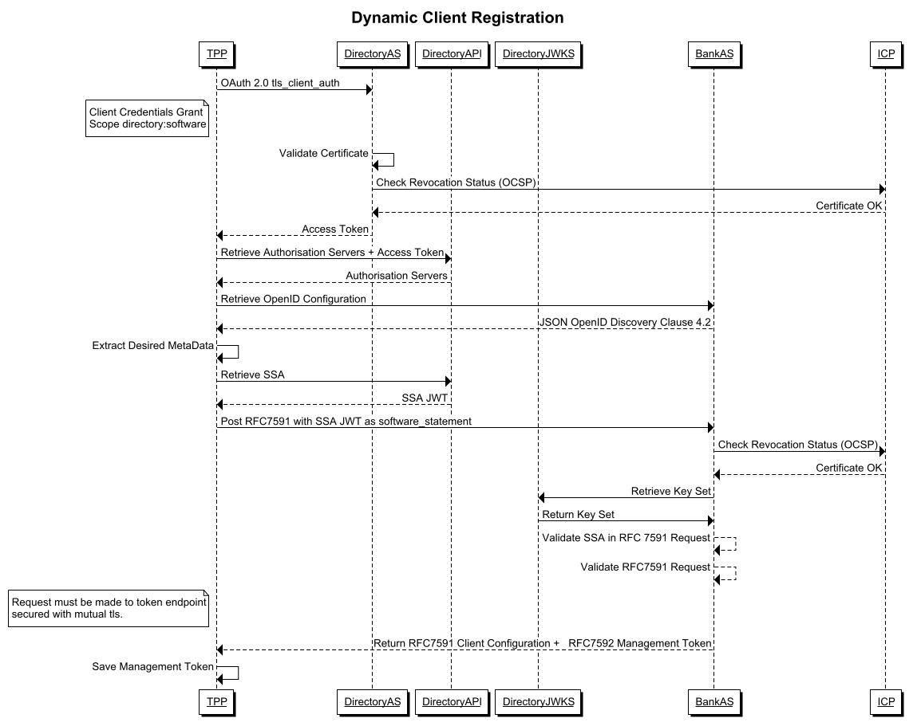

%%%

    #
    # Open Banking Brasil Financial-grade API Dynamic Client Registration Profile 1.0 Implementers Draft 1
    # (open-banking-brasil-dynamic-client-registration-1_ID1)
    #
    #

    Title = "Open Banking Brasil Financial-grade API Dynamic Client Registration 1.0 Implementers Draft 1"
    abbrev = "OBB-FAPI-1-DCR-ID1"
    ipr = "none"
    workgroup = "Open Banking Brasil GT Security"
    keyword = ["FAPI", "Open Banking Brasil GT Security"]

    [seriesInfo]
    name = "Internet-Draft"
    status = "standard"
    value = "open-banking-brasil-dynamic-client-registration-1_ID1-ptbr"
 
    [[author]]
    initials = "R."
    surname = "Bragg"
    fullname = "Ralph Bragg"
    organization = "Raidiam"
    abbrev = "Raidiam"
      [author.address]
      email = "ralph.bragg@raidiam.com"
      uri = "https://www.raidiam.com/"

    [[author]]
    initials = "GT"
    surname = "Security"
    fullname = "OBBIS GT Security"
    organization = "Open Banking Brasil Initial Structure"
    abbrev = "OBBIS"
      [author.address]
      email = "gt-seguranca@openbankingbr.org"
      uri = "https://openbankingbrasil.org.br/"

%%%

.# Prefácio  {#Forward}

The normative version in [English](https://openbanking-brasil.github.io/specs-seguranca/open-banking-brasil-dynamic-client-registration-1_ID1.html)

A Estrutura Inicial do Open Banking Brasil (EIOBB) é responsável por criar os padrões e especificações necessários para atender aos requisitos e obrigações da Legislação do Open Banking do Brasil, conforme originalmente delineado pelo [Banco Central do Brasil](https://www.bcb.gov.br/content/config/Documents/BCB_Open_Banking_Communique-April-2019.pdf). É possível que alguns dos elementos deste documento estejam sujeitos a direitos de patente. O EIOBB não se responsabiliza pela identificação de qualquer ou todos os direitos de patente.

O Perfil de Segurança Financial-grade API 1.0 do Open Banking Brasil consiste nas seguintes partes:

* [Open Banking Brasil Financial-grade API Security Profile 1.0][OBB-FAPI]
* Open Banking Brasil Dynamic Client Registration Profile 1.0

Essas partes devem ser usadas com [RFC6749], [RFC6750], [RFC7636], [OIDC], [OIDR], [RFC7591], [RFC7592], [FAPI-1-Baseline] e [FAPI-1-Advanced]

.# Introdução  {#Introduction}

O Perfil de Registro de Cliente Dinâmico (DCR - *Dynamic Client Registration*) do Financal-grade API (FAPI) do Open Banking Brasil é um perfil de [RFC7591], [RFC7592] e [OIDR] que visa fornecer diretrizes de implementação específicas para segurança e interoperabilidade que podem ser aplicadas à identificação, registro e gerenciamento de *Clients OAuth* operando no ecossistema Open Banking Brasil.

Embora seja possível codificar um *OpenID Provider* e *Relying Party* desde o princípio usando esta especificação, o principal público para esta especificação são as partes que já possuem uma implementação certificada do [OpenID Connect] [OIDC] e desejam obter a certificação para o Open Banking Brasil.

.# Convenções Notacionais  {#Conventions}

As palavras-chave "*deve*" (shall), "*não deve*" (shall not), "*deveria*" (should), "*não deveria*" (should not) e "*pode*" (may) presentes nesse documento devem ser interpretadas conforme as diretrizes descritas em [ISO Directive Part 2][ISODIR2] observando  seguinte equivalência:
  * "deve" => equivalente ao termo "shall" e expressa um requerimento definido no documento (nas traduções é similar ao termo "must", que pode denotar um requerimento externo ao documento);
  * "não deve" => equivalente ao termo "shall not" e também expressa um requerimento definido no documento;
  * "deveria" e "não deveria"=> equivalente ao termo "should" e "should not" e expressa uma recomendação
  * "pode" => equivalente ao termo "may" indica uma permissão

Estas palavras-chave não são usadas como termos de dicionário, de modo que qualquer ocorrência deles deve ser interpretada como palavras-chave e não devem ser interpretados com seus significados de linguagem natural.

{mainmatter}

# Escopo  {#Scope}

Este documento especifica o método de

* aplicativos cadastrados no [Diretório de Participantes do Open Banking](https://web.directory.openbankingbrasil.org.br) para descobrir OpenID Providers que oferecem serviços no ecossistema Open Banking Brasil;
* aplicativos para usar o [OpenID Connect Registration][OIDR] para integrar seus aplicativos com OpenID Providers dos bancos; e
* aplicativos para usar [OAuth 2.0 Dynamic Client Registration Management Protocol][RFC7592] para gerenciar seus aplicativos com OpenID Providers;

Este documento é aplicável a todos os participantes do Open Banking no Brasil.

# Referências normativas  {#Normative}

Os seguintes documentos referenciados são indispensáveis para a aplicação deste documento. Para referências datadas, apenas a edição citada se aplica. Para referências não datadas, a última edição do documento referenciado (incluindo quaisquer emendas) se aplica.

[ISODIR2] - ISO/IEC Directives Part 2
[ISODIR2]: <https://www.iso.org/sites/directives/current/part2/index.xhtml

[RFC6749] - The OAuth 2.0 Authorization Framework
[RFC6749]: <https://tools.ietf.org/html/rfc6749

[RFC6750] - The OAuth 2.0 Authorization Framework: Bearer Token Usage
[RFC6750]: <https://tools.ietf.org/html/rfc6750

[RFC7636] - Proof Key for Code Exchange by OAuth Public Clients
[RFC7636]: <https://tools.ietf.org/html/rfc7636

[RFC6819] - OAuth 2.0 Threat Model and Security Considerations
[RFC6819]: <https://tools.ietf.org/html/rfc6819

[RFC7519] - JSON Web Token (JWT)
[RFC7519]:<https://tools.ietf.org/html/rfc7519

[RFC7591] - OAuth 2.0 Dynamic Client Registration Protocol
[RFC7591]:<https://tools.ietf.org/html/rfc7591

[RFC7592] - OAuth 2.0 Dynamic Client Registration Management Protocol
[RFC7592]:<https://tools.ietf.org/html/rfc7592

[BCP195] - Recommendations for Secure Use of Transport Layer Security (TLS) and Datagram Transport Layer Security (DTLS)
[BCP195]: <https://tools.ietf.org/html/bcp195

[OIDC] - OpenID Connect Core 1.0 incorporating errata set 1
[OIDC]: <https://openid.net/specs/openid-connect-core-1_0.html

[FAPI-CIBA] - Financial-grade API: Client Initiated Backchannel Authentication Profile
[FAPI-CIBA]: <https://bitbucket.org/openid/fapi/src/master/Financial_API_WD_CIBA.md

[RFC4514] - Lightweight Directory Access Protocol (LDAP): String Representation of Distinguished Names
[RFC4514]: <https://www.rfc-editor.org/rfc/rfc4514

[OIDD] -  OpenID Connect Discovery 1.0 incorporating errata set 1
[OIDD]: <https://openid.net/specs/openid-connect-discovery-1_0.html

[OIDR] -  OpenID Connect Registration 1.0 incorporating errata set 1
[OIDR]: <https://openid.net/specs/openid-connect-registration-1_0.html

[RFC8705] - OAuth 2.0 Mutual TLS Client Authentication and Certificate Bound Access Tokens
[RFC8705]: <https://tools.ietf.org/html/rfc8705

[JARM] - Financial-grade API: JWT Secured Authorization Response Mode for OAuth 2.0 (JARM)
[JARM]: <https://bitbucket.org/openid/fapi/src/master/Financial_API_JWT_Secured_Authorization_Response_Mode.md

[PAR] - OAuth 2.0 Pushed Authorization Requests
[PAR]: <https://tools.ietf.org/html/draft-ietf-oauth-par

[JAR] - OAuth 2.0 JWT Secured Authorization Request
[JAR]: <https://tools.ietf.org/html/draft-ietf-oauth-jwsreq

[FAPI-1-Baseline] - Financial-grade API Security Profile 1.0 - Part 1: Baseline
[FAPI-1-Baseline]: <https://openid.net/specs/openid-financial-api-part-1-1_0.html

[FAPI-1-Advanced] - Financial-grade API Security Profile 1.0 - Part 2: Advanced
[FAPI-1-Advanced]: <https://openid.net/specs/openid-financial-api-part-2-1_0.html

[OBB-FAPI] - Open Banking Brasil Financial-grade API Security Profile 1.0
[OBB-FAPI]: <https://openbanking-brasil.github.io/specs-seguranca/open-banking-brasil-financial-api-1_ID1.html

[OBB-Cert-Standards] - Open Banking Brasil x.509 Certificate Standards
[OBB-Cert-Standards]: <https://openbanking-brasil.github.io/specs-seguranca/open-banking-brasil-certificate-standards-1_ID1.html

# Termos e definições  {#Definitions}

Para efeitos deste documento, aplicam-se os termos definidos em [RFC6749], [RFC6750], [RFC7636], [OpenID Connect Core][OIDC] e ISO29100.

# Símbolos e Termos abreviados  {#Abreviations}

**SSA** – Software Statement Assertion (Afirmação de Declaração de Software)

**SS** – Software Statement (Declaração de Software)

**DCR** – Dynamic Client Registration (Registro de Cliente Dinâmico)

**API** – Application Programming Interface (Interface de Programação da Aplicação)

**FAPI** - Financial-grade API

**HTTP** – Hyper Text Transfer Protocol

**OIDF** - OpenID Foundation

**REST** – Representational State Transfer

**TLS** – Transport Layer Security

# Introdução  {#Intro}

O ecossistema Open Banking Brasil apoia-se em um provedor de confiança ou _diretório de participantes_ como a fonte mais valiosa de informações sobre participantes credenciados e softwares que estão autorizados a participar do ecossistema Open Banking Brasil.

Os serviços do Diretório incluem:

* Registro e gerenciamento de software
* Registro e gerenciamento de credenciais de software usando certificados ICP
* Geração de Software Statement Assertion (SSA)

Os participantes do ecossistema devem aproveitar esses serviços para facilitar o registro de cliente OAuth orientado por API usando o processo descrito na cláusula 3.1.1 do [RFC7591] com metadados adicionais necessários para oferecer suporte ao OpenID Connect definido em [OpenID Connect Registration][OIDR].

Sempre que possível, os servidores de autorização devem comparar os metadados do cliente declarados por um cliente, feito como parte do registro ou solicitação de gerenciamento, com as declarações de metadados contidas em uma declaração de software. Nem todos os metadados que um cliente deseja fornecer podem estar contidos em uma declaração de software *(software statement)*, por exemplo, alternativa [Metadata Langauges and Script values](https://openid.net/specs/openid-connect-registration-1_0.html#LanguagesAndScripts).

# Provisionamentos do OpenID Connect Discovery do Open Banking Brasil

## Servidor de Autorização  {#AuthServers}

O servidor de autorização deve suportar [OpenID Connect Discovery][OIDD] conforme exigido pelo [Financial-grade API Security Profile 1.0 - Part 1: Baseline][FAPI-1-Baseline].

Adicionalmente, o Servidor de Autorização

1. deve anunciar sua presença no ecossistema Open Banking Brasil, sendo listada no Diretório de Participantes;
2. deve anunciar todos os recursos API REST do Open Banking Brasil protegidos pelo Provedor OpenID no Diretório de Participantes;
3. deve anunciar suporte para todos os mecanismos de assinatura, criptografia, autenticação e padrões necessários para suportar o [Open Banking Brasil Financial API][OBB-FAPI];
4. deve anunciar suporte para [OpenID Dynamic Client Registration][OIDR];
5. deve anunciar `mtls_endpoint_aliases` de acordo com a cláusula 5 [RFC 8705 OAuth 2.0 Mutual-TLS Client Authentication e Certificate-Bound Access Tokens][RF8705] o `token_endpoint`, `registration_endpoint` e `userinfo_endpoint`;
6. se suportar [OAuth 2.0 Pushed Authorisation Requests][PAR], deve anunciar por meio de [OIDD] `mtls_endpoint_aliases` o `push_authorization_request_endpoint`;
7. se suportar [Financial API - Client Initiated Back Channel Authentication][FAPI-CIBA], deve anunciar através de [OIDD] `mtls_endpoint_aliases` o `backchannel_authentication_endpoint`;

## Cliente

O cliente deve suportar [OpenID Connect Discovery] [OIDD] conforme exigido pelo [Financial-grade API Security Profile 1.0 - Part 1: Baseline][FAPI-1-Baseline].

Além disso, o servidor de autorização

1. deve contar com serviços de descoberta do ecossistemas fornecidos apenas pelo Diretório de Participantes;
2. deve derivar os metadados necessários do Authorization Server somente por meio do serviço OpenID Connect Discovery dos Authorization Servers;
3. quando presente, deve usar endpoints anunciados em `mtls_endpoint_aliases` conforme a cláusula 5 [RFC 8705 OAuth 2.0 Mutual-TLS Client Authentication e Certificate-Bound Access Tokens][RF8705];

# Provisões de registro OpenID Connect do Open Banking Brasil  {#Registration}

## Servidor de Autorização  {#RegAuth}

O servidor de autorização deve suportar o [RFC7591], [RFC7592] e [OpenID Registration][OIDR]

Além disso, o servidor de autorização

1. deve rejeitar as solicitações de registro de cliente dinâmico não realizadas em uma conexão protegida com mTLS usando certificados emitidos pelo Brasil ICP (produção) ou o Diretório de Participantes (sandbox);
2. deve validar que a solicitação contém _software_statement_ JWT assinado usando o algoritmo `PS256` emitido pelo Diretório de Participantes do Open Banking Brasil;
3. deve validar que o _software_statement_ foi emitido (iat  - *issued at*) não mais de 5 minutos antes do pedido ser recebido;
4. deve validar que um `jwks` (chave definida por valor) **não** foi incluído;
5. deve exigir e validar que o `jwks_uri` corresponda ao `software_jwks_uri` fornecido na declaração do software;
6. deve exigir e validar que o `redirect_uris` corresponde ou contém um subconjunto de `software_redirect_uris` fornecido na declaração do software;
7. deve exigir e validar que todos os mecanismos de autenticação de cliente cumpram os requisitos definidos em [Financial-grade API Security Profile 1.0 - Part 1: Advanced](https://openid.net/specs/openid-financial-api-part-2-1_0.html);
8. deve exigir requisições criptografadoas de objetos conforme exigido pelo Perfil de Segurança do Open Banking Brasil;
9. deve validar se os escopos solicitados são adequados para as funções regulatórias autorizadas do software;
10. deve, sempre que possível, validar os metadados declarados pelo cliente em relação aos metadados fornecidos no _software_statement_;
11. deve aceitar todos os nomes x.500 AttributeType definidas no _Distinguished Name_ dos Perfis de Certificado x.509 definidos em [Open Banking Brasil x.509 Certificate Standards][OBB-Cert-Standards];
12. se for compatível com o mecanismo de autenticação do cliente `tls_client_auth`, conforme definido em [RFC8705], somente deve aceitar `tls_client_auth_subject_dn` como uma indicação do valor do assunto do certificado, conforme definido na cláusula 2.1.2 [RFC8705];

Estas disposições aplicam-se igualmente ao processamento de pedidos [RFC7591], [RFC7592] e [OpenID Registration][OIDR]

### Aplicando Server Defaults  {#Server}

Quando as propriedades de uma solicitação DCR não estão incluídas e não são obrigatórias na especificação, o Authorization Server deve aplicar os padrões do cliente da seguinte maneira

1. deve selecionar e aplicar o algoritmo de criptografia e a escolha da cifra a partir dos conjuntos mais recomendados de cifra da IANA que são suportados pelo Servidor de Autorização;
2. deve preencher *defaults* a partir de valores da afirmação de declaração de software (SSA), sempre que possível;
3. deve conceder ao cliente permissão para o conjunto completo de escopos potenciais com base nas permissões regulatórias de softwares incluídas no _software_statement_;

### Análise do Distinguished Name do Certificado  {#Certificate}

A cláusula 3 do [Lightweight Directory Access Protocol (LDAP): String Representation of Distinguished Names][RFC4514] define os OIDs obrigatórios cujas as _strings_ do AttributeType (descritores) devem ser reconhecidos pelos implementadores. Esta lista obrigatória não inclui vários dos OIDs definidos em [Open Banking Brasil x.509 Certificate Standards][OBB-Cert-Standards], nem existe um mecanismo definido para os Servidores de Autorização publicarem informações sobre o formato que eles esperam de uma Solicitação Dinâmica de Registro do Cliente (_Dynamic Client Registrarion_) que inclui um `tls_client_auth_subject_dn`.

Para resolver essa ambigüidade, o Servidor de Autorização deve aceitar todas as strings de nome de AttributeType (descritores) definidas no último parágrafo da cláusula 3 [RFC4515], além de todos os AttributeTypes definidos no Distinguished Name [Open Banking Brasil x.509 Certificate Standards][OBB-Cert-Standards].

## Funções regulatórias para mapeamentos OpenID e OAuth 2.0  {#Regs}

Para participar do ecossistema do Open Banking, as instituições credenciadas devem se cadastrar no Diretório de Participantes de acordo com seus papéis regulatórios. Essas funções refletem a autorização do Banco Central para as instituições e, consequentemente, as APIs que podem utilizar.

A tabela a seguir descreve as funções regulatórias do Open Banking e o mapeamento de escopos do OAuth 2.0 relacionado. Se os escopos forem omitidos durante o processo de DCR, o Servidor de Autorização deve conceder o conjunto completo de escopos potenciais com base nas funções regulatórias registradas para o banco, conforme descrito na seção Server Defaults.

| Papel Regulador | Descrição | Escopos Permitidos | Fase-alvo |
| --- | --- | --- | --- |
| DADOS | Instituição transmissora / receptora de dados (AISP) | openid accounts credit-cards-accounts consents customers invoice-financings financings loans unarranged-accounts-overdraft | Phase 2 |
| PAGTO | Instituição prestadora de serviço de iniciação de pagamentos (PISP) | openid payments consents | Phase 3 |
| CONTA | Instituição detentora de conta (ASPSP) | openid | Phase 3 |
| CCORR | Correspondente de crédito | openid | Phase 3* |

### Nota dos Implementadores  {#ImplementorsNotes}

Em linha com a orientação do IETF e com o conceito diretivo do gerenciamento de consentimento com menor granularidade. A obrigação recai sobre o Servidor de Autorização para garantir que haja escopo suficiente transmitido em um *access token* necessário para cumprir as Permissões transmitidas na Solicitação de Consentimento. Este princípio e requisito são refletidos na futura API de gerenciamento de consentimentos.

## Funções regulatórias para mapeamentos de escopo OAuth 2.0 dinâmicos  {#Roles}

| Papel Regulador | Escopos Permitidos |
| --- | --- |
| DADOS | consent:{ConsentId} |
| PAGTO | consent:{ConsentId} |

# Declaração de Software  {#SSA}

Uma declaração de software é um JSON Web Token (JWT) [RFC7519] que afirma valores de metadados sobre o software cliente como um todo.

## Reinvidicações da Declaração de Software (Claims)  {#Claims}

O exemplo a seguir contém todas as reivindicações atualmente incluídas em uma declaração de software

```
{
  "software_mode": "Live",
  "software_redirect_uris": [
    "https://www.raidiam.com/accounting/cb"
  ],
  "software_statement_roles": [
    {
      "role": "DADOS",
      "authorisation_domain": "Open Banking",
      "status": "Active"
    },
    {
      "role": "PAGTO",
      "authorisation_domain": "Open Banking",
      "status": "Active"
    }
  ],
  "software_client_name": "Raidiam Accounting",
  "org_status": "Active",
  "software_client_id": "Cki1EbvjwyhPB12NGLlz2",
  "iss": "Open Banking Open Banking Brasil prod SSA issuer",
  "software_tos_uri": "https://www.raidiam.com/accounting/tos.html",
  "software_client_description": "Raidiam Accounting leverage cutting edge open banking access to bring you real time up to date views of your finances",
  "software_jwks_uri": "https://keystore.directory.openbankingbrasil.org.br/b961c4eb-509d-4edf-afeb-35642b38185d/25556d5a-b9dd-4e27-aa1a-cce732fe74de/application.jwks",
  "software_policy_uri": "https://www.raidiam.com/accounting/policy.html",
  "software_id": "25556d5a-b9dd-4e27-aa1a-cce732fe74de",
  "software_client_uri": "https://www.raidiam.com/accounting.html",
  "software_jwks_inactive_uri": "https://keystore.directory.openbankingbrasil.org.br/b961c4eb-509d-4edf-afeb-35642b38185d/25556d5a-b9dd-4e27-aa1a-cce732fe74de/inactive/application.jwks",
  "software_jwks_transport_inactive_uri": "https://keystore.directory.openbankingbrasil.org.br/b961c4eb-509d-4edf-afeb-35642b38185d/25556d5a-b9dd-4e27-aa1a-cce732fe74de/inactive/transport.jwks",
  "software_jwks_transport_uri": "https://keystore.directory.openbankingbrasil.org.br/b961c4eb-509d-4edf-afeb-35642b38185d/25556d5a-b9dd-4e27-aa1a-cce732fe74de/transport.jwks",
  "software_logo_uri": "https://www.raidiam.com/accounting/logo.png",
  "org_id": "b961c4eb-509d-4edf-afeb-35642b38185d",
  "org_number": "112233445566",
  "software_environment": "production",
  "software_version": "1.1",
  "software_roles": [
    "DADOS",
    "PAGTO"
  ],
  "org_name": "Open Banking Brasil",
  "iat": 1620060821,
  "organisation_competent_authority_claims": [
    {
      "authorisation_domain": "Open Banking",
      "authorisations": [],
      "registration_id": "13353236-OBB-CONTA",
      "authority_id": "687a1c94-b360-4e04-9589-0fa5cb16451b",
      "authority_name": "Banco Central",
      "authorisation_role": "CONTA",
      "authority_code": "BCB",
      "status": "Active"
    },
    {
      "authorisation_domain": "Open Banking",
      "authorisations": [],
      "registration_id": "13353236-OBB-DADOS",
      "authority_id": "687a1c94-b360-4e04-9589-0fa5cb16451b",
      "authority_name": "Banco Central",
      "authorisation_role": "DADOS",
      "authority_code": "BCB",
      "status": "Active"
    },
    {
      "authorisation_domain": "Open Banking",
      "authorisations": [],
      "registration_id": "13353236-OBB-PAGTO",
      "authority_id": "687a1c94-b360-4e04-9589-0fa5cb16451b",
      "authority_name": "Banco Central",
      "authorisation_role": "PAGTO",
      "authority_code": "BCB",
      "status": "Active"
    }
  ]
}
```

# Processamento de solicitação de registro de cliente dinâmico  {#dcr}

!---

!---

## Enviar uma solicitação com uma declaração de software  {#exampleDcr}

Este exemplo inclui vários campos opcionais, alguns dos quais podem não ser aplicáveis a algumas implantações. A quebra de linha dentro dos valores são apenas para fins de exibição.

```
POST /reg HTTP/1.1
Host: auth.raidiam.com
Content-Type: application/json
{
"application_type": "web",
"grant_types": [
    "client_credentials",
    "authorization_code",
    "refresh_token",
    "implicit"
],
"id_token_signed_response_alg": "PS256",
"require_auth_time": false,
"response_types": [
    "code id_token",
    "id_token"
],
"software_statement": "eyJraWQiOiJzaWduZXIiLCJ0eXAiOiJKV1QiLCJhbGciOiJQUzI1NiJ9.eyJzb2Z0d2FyZV9tb2RlIjoiTGl2ZSIsInNvZnR3YXJlX3JlZGlyZWN0X3VyaXMiOlsiaHR0cHM6XC9cL3d3dy5yYWlkaWFtLmNvbVwvYWNjb3VudGluZ1wvY2IiXSwic29mdHdhcmVfc3RhdGVtZW50X3JvbGVzIjpbeyJyb2xlIjoiREFET1MiLCJhdXRob3Jpc2F0aW9uX2RvbWFpbiI6Ik9wZW4gQmFua2luZyIsInN0YXR1cyI6IkFjdGl2ZSJ9LHsicm9sZSI6IlBBR1RPIiwiYXV0aG9yaXNhdGlvbl9kb21haW4iOiJPcGVuIEJhbmtpbmciLCJzdGF0dXMiOiJBY3RpdmUifV0sInNvZnR3YXJlX2NsaWVudF9uYW1lIjoiUmFpZGlhbSBBY2NvdW50aW5nIiwib3JnX3N0YXR1cyI6IkFjdGl2ZSIsInNvZnR3YXJlX2NsaWVudF9pZCI6IkNraTFFYnZqd3loUEIxMk5HTGx6MiIsImlzcyI6Ik9wZW4gQmFua2luZyBPcGVuIEJhbmtpbmcgQnJhc2lsIHByb2QgU1NBIGlzc3VlciIsInNvZnR3YXJlX3Rvc191cmkiOiJodHRwczpcL1wvd3d3LnJhaWRpYW0uY29tXC9hY2NvdW50aW5nXC90b3MuaHRtbCIsInNvZnR3YXJlX2NsaWVudF9kZXNjcmlwdGlvbiI6IlJhaWRpYW0gQWNjb3VudGluZyBsZXZlcmFnZSBjdXR0aW5nIGVkZ2Ugb3BlbiBiYW5raW5nIGFjY2VzcyB0byBicmluZyB5b3UgcmVhbCB0aW1lIHVwIHRvIGRhdGUgdmlld3Mgb2YgeW91ciBmaW5hbmNlcyIsInNvZnR3YXJlX2p3a3NfZW5kcG9pbnQiOiJodHRwczpcL1wva2V5c3RvcmUuZGlyZWN0b3J5Lm9wZW5iYW5raW5nYnJhc2lsLm9yZy5iclwvYjk2MWM0ZWItNTA5ZC00ZWRmLWFmZWItMzU2NDJiMzgxODVkXC8yNTU1NmQ1YS1iOWRkLTRlMjctYWExYS1jY2U3MzJmZTc0ZGVcL2FwcGxpY2F0aW9uLmp3a3MiLCJzb2Z0d2FyZV9wb2xpY3lfdXJpIjoiaHR0cHM6XC9cL3d3dy5yYWlkaWFtLmNvbVwvYWNjb3VudGluZ1wvcG9saWN5Lmh0bWwiLCJzb2Z0d2FyZV9pZCI6IjI1NTU2ZDVhLWI5ZGQtNGUyNy1hYTFhLWNjZTczMmZlNzRkZSIsInNvZnR3YXJlX2NsaWVudF91cmkiOiJodHRwczpcL1wvd3d3LnJhaWRpYW0uY29tXC9hY2NvdW50aW5nLmh0bWwiLCJzb2Z0d2FyZV9qd2tzX2luYWN0aXZlX2VuZHBvaW50IjoiaHR0cHM6XC9cL2tleXN0b3JlLmRpcmVjdG9yeS5vcGVuYmFua2luZ2JyYXNpbC5vcmcuYnJcL2I5NjFjNGViLTUwOWQtNGVkZi1hZmViLTM1NjQyYjM4MTg1ZFwvMjU1NTZkNWEtYjlkZC00ZTI3LWFhMWEtY2NlNzMyZmU3NGRlXC9pbmFjdGl2ZVwvYXBwbGljYXRpb24uandrcyIsInNvZnR3YXJlX2p3a3NfdHJhbnNwb3J0X2luYWN0aXZlX2VuZHBvaW50IjoiaHR0cHM6XC9cL2tleXN0b3JlLmRpcmVjdG9yeS5vcGVuYmFua2luZ2JyYXNpbC5vcmcuYnJcL2I5NjFjNGViLTUwOWQtNGVkZi1hZmViLTM1NjQyYjM4MTg1ZFwvMjU1NTZkNWEtYjlkZC00ZTI3LWFhMWEtY2NlNzMyZmU3NGRlXC9pbmFjdGl2ZVwvdHJhbnNwb3J0Lmp3a3MiLCJzb2Z0d2FyZV9qd2tzX3RyYW5zcG9ydF9lbmRwb2ludCI6Imh0dHBzOlwvXC9rZXlzdG9yZS5kaXJlY3Rvcnkub3BlbmJhbmtpbmdicmFzaWwub3JnLmJyXC9iOTYxYzRlYi01MDlkLTRlZGYtYWZlYi0zNTY0MmIzODE4NWRcLzI1NTU2ZDVhLWI5ZGQtNGUyNy1hYTFhLWNjZTczMmZlNzRkZVwvdHJhbnNwb3J0Lmp3a3MiLCJzb2Z0d2FyZV9sb2dvX3VyaSI6Imh0dHBzOlwvXC93d3cucmFpZGlhbS5jb21cL2FjY291bnRpbmdcL2xvZ28ucG5nIiwib3JnX2lkIjoiYjk2MWM0ZWItNTA5ZC00ZWRmLWFmZWItMzU2NDJiMzgxODVkIiwic29mdHdhcmVfZW52aXJvbm1lbnQiOiJwcm9kdWN0aW9uIiwic29mdHdhcmVfdmVyc2lvbiI6MS4xMCwic29mdHdhcmVfcm9sZXMiOlsiREFET1MiLCJQQUdUTyJdLCJvcmdfbmFtZSI6Ik9wZW4gQmFua2luZyBCcmFzaWwiLCJpYXQiOjE2MTgzMzYyNjIsIm9yZ2FuaXNhdGlvbl9jb21wZXRlbnRfYXV0aG9yaXR5X2NsYWltcyI6W3siYXV0aG9yaXNhdGlvbl9kb21haW4iOiJPcGVuIEJhbmtpbmciLCJhdXRob3Jpc2F0aW9ucyI6W10sInJlZ2lzdHJhdGlvbl9pZCI6IjEzMzUzMjM2LU9CQi1DT05UQSIsImF1dGhvcml0eV9pZCI6IjY4N2ExYzk0LWIzNjAtNGUwNC05NTg5LTBmYTVjYjE2NDUxYiIsImF1dGhvcmlzYXRpb25fcm9sZSI6IkNPTlRBIiwiYXV0aG9yaXR5X2NvZGUiOiJCQ0IiLCJzdGF0dXMiOiJBY3RpdmUifSx7ImF1dGhvcmlzYXRpb25fZG9tYWluIjoiT3BlbiBCYW5raW5nIiwiYXV0aG9yaXNhdGlvbnMiOltdLCJyZWdpc3RyYXRpb25faWQiOiIxMzM1MzIzNi1PQkItREFET1MiLCJhdXRob3JpdHlfaWQiOiI2ODdhMWM5NC1iMzYwLTRlMDQtOTU4OS0wZmE1Y2IxNjQ1MWIiLCJhdXRob3Jpc2F0aW9uX3JvbGUiOiJEQURPUyIsImF1dGhvcml0eV9jb2RlIjoiQkNCIiwic3RhdHVzIjoiQWN0aXZlIn0seyJhdXRob3Jpc2F0aW9uX2RvbWFpbiI6Ik9wZW4gQmFua2luZyIsImF1dGhvcmlzYXRpb25zIjpbXSwicmVnaXN0cmF0aW9uX2lkIjoiMTMzNTMyMzYtT0JCLVBBR1RPIiwiYXV0aG9yaXR5X2lkIjoiNjg3YTFjOTQtYjM2MC00ZTA0LTk1ODktMGZhNWNiMTY0NTFiIiwiYXV0aG9yaXNhdGlvbl9yb2xlIjoiUEFHVE8iLCJhdXRob3JpdHlfY29kZSI6IkJDQiIsInN0YXR1cyI6IkFjdGl2ZSJ9XX0.W6hUAYhjT6I61rxEIVMKYKre93LTbRdzKnk9dJvUdzVgAz5B9KxZNutf27oO3k0hrjYVWBdWq23o_e4Y_AaKdpS9-rtU84JiHtmqV0wcFYIM8nqcUVWqQ-Ux6Nq9L2G-s2YNd3PcJ1e3yGg9h8553Gr7iJusKEgApzXUpkM2rBELQuumktUE_JBiuIkXmWxoRnO1cW-Osbk3MT3bxG43SPcxii07Q5S8qXI6PjCPA3fYlnaUAygwZM3O0oa7jqmSr7d9UsHuDMJfYhIKdq2wyQQKORCN-D2UopmMX-lHMvAVkkrAO08T0-7odjr4PJk-PrwuoCxeAfa7440ZDOrlmQ",
"subject_type": "public",
"token_endpoint_auth_method": "private_key_jwt",
"introspection_endpoint_auth_method": "private_key_jwt",
"revocation_endpoint_auth_method": "private_key_jwt",
"request_object_signing_alg": "PS256",
"require_signed_request_object": true,
"require_pushed_authorization_requests": false,
"tls_client_certificate_bound_access_tokens": true,
"client_id": "aCnBHjZBvD6ku3KVBaslL",
"client_name": "Raidiam Accounting",
"client_uri": "https://www.raidiam.com/accounting.html",
"request_object_encryption_alg": "RSA-OAEP",
"request_object_encryption_enc": "A256GCM"
"jwks_uri": "https://keystore.directory.openbankingbrasil.org.br/b961c4eb-509d-4edf-afeb-35642b38185d/25556d5a-b9dd-4e27-aa1a-cce732fe74de/application.jwks",
"redirect_uris": [
    "https://www.raidiam.com/accounting/cb"
]
}
```

## Open Banking Brasil SSA Key Store e detalhes do emissor  {#keystore}

**Producão**

[https://keystore.directory.openbankingbrasil.org.br/openbanking.jwks](https://keystore.directory.openbankingbrasil.org.br/openbanking.jwks)

Emissor do Open Banking Open Banking Brasil SSA de produção

**Sandbox**

[https://keystore.sandbox.directory.openbankingbrasil.org.br/openbanking.jwks](https://keystore.sandbox.directory.openbankingbrasil.org.br/openbanking.jwks)

Emissor do Open Banking Open Banking Brasil SSA de sandbox

# Reconhecimento  {#acknowledgements}

Agradecemos a todos que estabeleceram as bases para o compartilhamento seguro de dados por meio da formação do Grupo de Trabalho OpenID Foundation FAPI, o GT de Segurança do Open Banking Brasil e aos pioneiros que ficarão em seus ombros.

As seguintes pessoas contribuíram para este documento:

* Ralph Bragg (Raidiam)
* Alexandre Siqueira (Mercado Pago)
* Bernardo Vale (Banco Inter)

*
{backmatter}

# Avisos

Copyright (c) 2021 Estrutura Inicial do Open Banking Brasil

A Estrutura Inicial do Open Banking Brasil (EIOBB) concede a qualquer Colaborador, desenvolvedor, implementador ou outra parte interessada uma licença de direitos autorais mundial não exclusiva, livre de royalties para reproduzir, preparar trabalhos derivados, distribuir, executar e exibir, estes Implementadores Rascunho ou Especificação Final exclusivamente para fins de (i) desenvolver especificações e (ii) implementar Rascunhos de Implementadores e Especificações Finais com base em tais documentos, desde que a atribuição seja feita ao EIOBB como a fonte do material, mas que tal atribuição o faça não indica endosso do EIOBB.

A tecnologia descrita nesta especificação foi disponibilizada a partir de contribuições de várias fontes, incluindo membros da OpenID Foundation, do Grupo de Trabalho de Segurança do Open Banking Brasil e outros. Embora a Estrutura Inicial do Open Banking Brasil tenha tomado medidas para ajudar a garantir que a tecnologia esteja disponível para distribuição, ela não toma posição quanto à validade ou escopo de qualquer propriedade intelectual ou outros direitos que possam ser reivindicados como pertencentes à implementação ou uso do tecnologia descrita nesta especificação ou até que ponto qualquer licença sob tais direitos pode ou não estar disponível; nem representa que fez qualquer esforço independente para identificar tais direitos. A Estrutura Inicial do Open Banking Brasil e os contribuidores desta especificação não oferecem (e por meio deste expressamente se isentam de quaisquer) garantias (expressas, implícitas ou de outra forma), incluindo garantias implícitas de comercialização, não violação, adequação a uma finalidade específica ou título, relacionados a esta especificação, e todo o risco quanto à implementação desta especificação é assumido pelo implementador. A política de Direitos de Propriedade Intelectual do Open Banking Brasil exige que os contribuidores ofereçam uma promessa de patente de não fazer valer certas reivindicações de patentes contra outros contribuidores e implementadores. A Estrutura Inicial do Open Banking Brasil convida qualquer parte interessada a trazer à sua atenção quaisquer direitos autorais, patentes, pedidos de patentes ou outros direitos de propriedade que possam abranger a tecnologia que possa ser necessária para praticar esta especificação.

## Apêndice A. Exemplo de afirmação de declaração de software  {#ExampleA}

```
eyJraWQiOiJzaWduZXIiLCJ0eXAiOiJKV1QiLCJhbGciOiJQUzI1NiJ9.eyJzb2Z0d2FyZV9tb2RlIjoiTGl2ZSIsInNvZnR3YXJlX3JlZGlyZWN0X3VyaXMiOlsiaHR0cHM6XC9cL3d3dy5yYWlkaWFtLmNvbVwvYWNjb3VudGluZ1wvY2IiXSwic29mdHdhcmVfc3RhdGVtZW50X3JvbGVzIjpbeyJyb2xlIjoiREFET1MiLCJhdXRob3Jpc2F0aW9uX2RvbWFpbiI6Ik9wZW4gQmFua2luZyIsInN0YXR1cyI6IkFjdGl2ZSJ9LHsicm9sZSI6IlBBR1RPIiwiYXV0aG9yaXNhdGlvbl9kb21haW4iOiJPcGVuIEJhbmtpbmciLCJzdGF0dXMiOiJBY3RpdmUifV0sInNvZnR3YXJlX2NsaWVudF9uYW1lIjoiUmFpZGlhbSBBY2NvdW50aW5nIiwib3JnX3N0YXR1cyI6IkFjdGl2ZSIsInNvZnR3YXJlX2NsaWVudF9pZCI6IkNraTFFYnZqd3loUEIxMk5HTGx6MiIsImlzcyI6Ik9wZW4gQmFua2luZyBPcGVuIEJhbmtpbmcgQnJhc2lsIHByb2QgU1NBIGlzc3VlciIsInNvZnR3YXJlX3Rvc191cmkiOiJodHRwczpcL1wvd3d3LnJhaWRpYW0uY29tXC9hY2NvdW50aW5nXC90b3MuaHRtbCIsInNvZnR3YXJlX2NsaWVudF9kZXNjcmlwdGlvbiI6IlJhaWRpYW0gQWNjb3VudGluZyBsZXZlcmFnZSBjdXR0aW5nIGVkZ2Ugb3BlbiBiYW5raW5nIGFjY2VzcyB0byBicmluZyB5b3UgcmVhbCB0aW1lIHVwIHRvIGRhdGUgdmlld3Mgb2YgeW91ciBmaW5hbmNlcyIsInNvZnR3YXJlX2p3a3NfZW5kcG9pbnQiOiJodHRwczpcL1wva2V5c3RvcmUuZGlyZWN0b3J5Lm9wZW5iYW5raW5nYnJhc2lsLm9yZy5iclwvYjk2MWM0ZWItNTA5ZC00ZWRmLWFmZWItMzU2NDJiMzgxODVkXC8yNTU1NmQ1YS1iOWRkLTRlMjctYWExYS1jY2U3MzJmZTc0ZGVcL2FwcGxpY2F0aW9uLmp3a3MiLCJzb2Z0d2FyZV9wb2xpY3lfdXJpIjoiaHR0cHM6XC9cL3d3dy5yYWlkaWFtLmNvbVwvYWNjb3VudGluZ1wvcG9saWN5Lmh0bWwiLCJzb2Z0d2FyZV9pZCI6IjI1NTU2ZDVhLWI5ZGQtNGUyNy1hYTFhLWNjZTczMmZlNzRkZSIsInNvZnR3YXJlX2NsaWVudF91cmkiOiJodHRwczpcL1wvd3d3LnJhaWRpYW0uY29tXC9hY2NvdW50aW5nLmh0bWwiLCJzb2Z0d2FyZV9qd2tzX2luYWN0aXZlX2VuZHBvaW50IjoiaHR0cHM6XC9cL2tleXN0b3JlLmRpcmVjdG9yeS5vcGVuYmFua2luZ2JyYXNpbC5vcmcuYnJcL2I5NjFjNGViLTUwOWQtNGVkZi1hZmViLTM1NjQyYjM4MTg1ZFwvMjU1NTZkNWEtYjlkZC00ZTI3LWFhMWEtY2NlNzMyZmU3NGRlXC9pbmFjdGl2ZVwvYXBwbGljYXRpb24uandrcyIsInNvZnR3YXJlX2p3a3NfdHJhbnNwb3J0X2luYWN0aXZlX2VuZHBvaW50IjoiaHR0cHM6XC9cL2tleXN0b3JlLmRpcmVjdG9yeS5vcGVuYmFua2luZ2JyYXNpbC5vcmcuYnJcL2I5NjFjNGViLTUwOWQtNGVkZi1hZmViLTM1NjQyYjM4MTg1ZFwvMjU1NTZkNWEtYjlkZC00ZTI3LWFhMWEtY2NlNzMyZmU3NGRlXC9pbmFjdGl2ZVwvdHJhbnNwb3J0Lmp3a3MiLCJzb2Z0d2FyZV9qd2tzX3RyYW5zcG9ydF9lbmRwb2ludCI6Imh0dHBzOlwvXC9rZXlzdG9yZS5kaXJlY3Rvcnkub3BlbmJhbmtpbmdicmFzaWwub3JnLmJyXC9iOTYxYzRlYi01MDlkLTRlZGYtYWZlYi0zNTY0MmIzODE4NWRcLzI1NTU2ZDVhLWI5ZGQtNGUyNy1hYTFhLWNjZTczMmZlNzRkZVwvdHJhbnNwb3J0Lmp3a3MiLCJzb2Z0d2FyZV9sb2dvX3VyaSI6Imh0dHBzOlwvXC93d3cucmFpZGlhbS5jb21cL2FjY291bnRpbmdcL2xvZ28ucG5nIiwib3JnX2lkIjoiYjk2MWM0ZWItNTA5ZC00ZWRmLWFmZWItMzU2NDJiMzgxODVkIiwic29mdHdhcmVfZW52aXJvbm1lbnQiOiJwcm9kdWN0aW9uIiwic29mdHdhcmVfdmVyc2lvbiI6MS4xMCwic29mdHdhcmVfcm9sZXMiOlsiREFET1MiLCJQQUdUTyJdLCJvcmdfbmFtZSI6Ik9wZW4gQmFua2luZyBCcmFzaWwiLCJpYXQiOjE2MTgzMzYyNjIsIm9yZ2FuaXNhdGlvbl9jb21wZXRlbnRfYXV0aG9yaXR5X2NsYWltcyI6W3siYXV0aG9yaXNhdGlvbl9kb21haW4iOiJPcGVuIEJhbmtpbmciLCJhdXRob3Jpc2F0aW9ucyI6W10sInJlZ2lzdHJhdGlvbl9pZCI6IjEzMzUzMjM2LU9CQi1DT05UQSIsImF1dGhvcml0eV9pZCI6IjY4N2ExYzk0LWIzNjAtNGUwNC05NTg5LTBmYTVjYjE2NDUxYiIsImF1dGhvcmlzYXRpb25fcm9sZSI6IkNPTlRBIiwiYXV0aG9yaXR5X2NvZGUiOiJCQ0IiLCJzdGF0dXMiOiJBY3RpdmUifSx7ImF1dGhvcmlzYXRpb25fZG9tYWluIjoiT3BlbiBCYW5raW5nIiwiYXV0aG9yaXNhdGlvbnMiOltdLCJyZWdpc3RyYXRpb25faWQiOiIxMzM1MzIzNi1PQkItREFET1MiLCJhdXRob3JpdHlfaWQiOiI2ODdhMWM5NC1iMzYwLTRlMDQtOTU4OS0wZmE1Y2IxNjQ1MWIiLCJhdXRob3Jpc2F0aW9uX3JvbGUiOiJEQURPUyIsImF1dGhvcml0eV9jb2RlIjoiQkNCIiwic3RhdHVzIjoiQWN0aXZlIn0seyJhdXRob3Jpc2F0aW9uX2RvbWFpbiI6Ik9wZW4gQmFua2luZyIsImF1dGhvcmlzYXRpb25zIjpbXSwicmVnaXN0cmF0aW9uX2lkIjoiMTMzNTMyMzYtT0JCLVBBR1RPIiwiYXV0aG9yaXR5X2lkIjoiNjg3YTFjOTQtYjM2MC00ZTA0LTk1ODktMGZhNWNiMTY0NTFiIiwiYXV0aG9yaXNhdGlvbl9yb2xlIjoiUEFHVE8iLCJhdXRob3JpdHlfY29kZSI6IkJDQiIsInN0YXR1cyI6IkFjdGl2ZSJ9XX0.W6hUAYhjT6I61rxEIVMKYKre93LTbRdzKnk9dJvUdzVgAz5B9KxZNutf27oO3k0hrjYVWBdWq23o_e4Y_AaKdpS9-rtU84JiHtmqV0wcFYIM8nqcUVWqQ-Ux6Nq9L2G-s2YNd3PcJ1e3yGg9h8553Gr7iJusKEgApzXUpkM2rBELQuumktUE_JBiuIkXmWxoRnO1cW-Osbk3MT3bxG43SPcxii07Q5S8qXI6PjCPA3fYlnaUAygwZM3O0oa7jqmSr7d9UsHuDMJfYhIKdq2wyQQKORCN-D2UopmMX-lHMvAVkkrAO08T0-7odjr4PJk-PrwuoCxeAfa7440ZDOrlmQ
```
