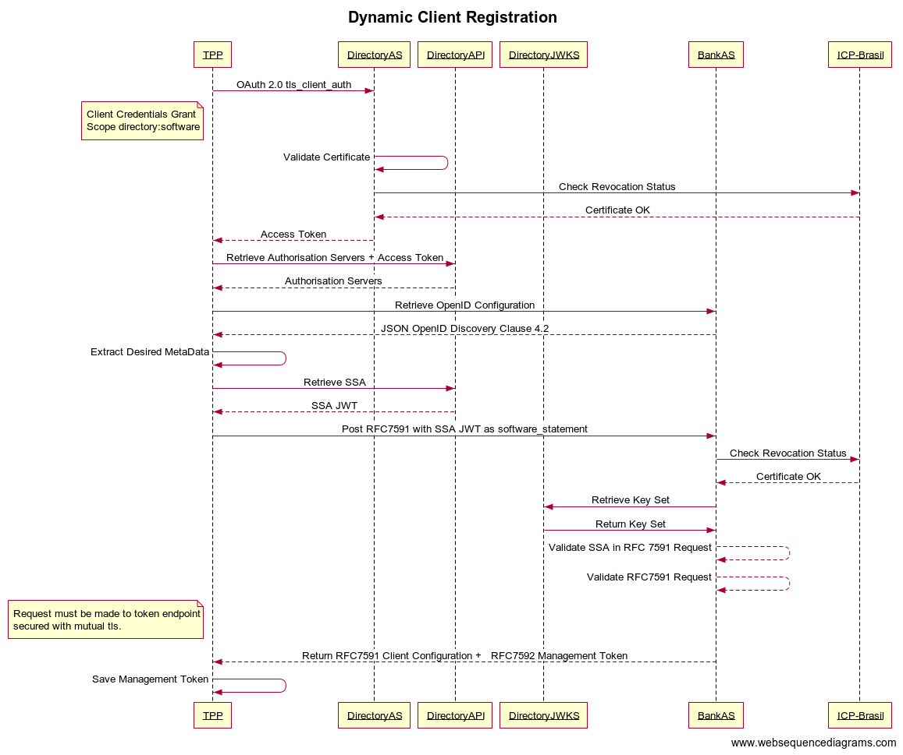

%%%

    #
    # Open Banking Brasil Financial-grade API Dynamic Client Registration Profile 1.0 Implementers Draft 1
    # (open-banking-brasil-dynamic-client-registration-1_ID1)
    #
    #

    Title = "Open Banking Brasil Financial-grade API Dynamic Client Registration 1.0 Implementers Draft 1"
    abbrev = "OBB-FAPI-1-DCR-ID1"
    ipr = "none"
    workgroup = "Open Banking Brasil GT Security"
    keyword = ["FAPI", "Open Banking Brasil GT Security"]

    [seriesInfo]
    name = "Internet-Draft"
    status = "standard"
    value = "open-banking-brasil-dynamic-client-registration-1_ID1"

    [[author]]
    initials = "R."
    surname = "Bragg"
    fullname = "Ralph Bragg"
    organization = "Raidiam"
    abbrev = "Raidiam"
      [author.address]
      email = "ralph.bragg@raidiam.com"
      uri = "https://www.raidiam.com/"

    [[author]]
    initials = "GT"
    surname = "Security"
    fullname = "OBBIS GT Security"
    organization = "Open Banking Brasil Initial Structure"
    abbrev = "OBBIS"
      [author.address]
      email = "gt-seguranca@openbankingbr.org"
      uri = "https://openbankingbrasil.org.br/"

%%%

.# Foreword

Este documento também está disponível em [português](https://openbanking-brasil.github.io/specs-seguranca/open-banking-brasil-dynamic-client-registration-1_ID1-ptbr.html)

The Open Banking Brasil Initial Structure is responsible for creating standards and specifications necessary to meet the requirements and obligations of the Brasil Open Banking Legislation as originally outlined by the [Brasil Central Bank](https://www.bcb.gov.br/content/config/Documents/BCB_Open_Banking_Communique-April-2019.pdf). There is a possibility that some of the elements of this document may be the subject to patent rights. OBBIS shall not be held responsible for identifying any or all such patent rights.

Open Banking Brasil Financial-grade API Security Profile 1.0 consists of the following parts:

* [Open Banking Brasil Financial-grade API Security Profile 1.0][OBB-FAPI]
* Open Banking Brasil Dynamic Client Registration Profile 1.0

These parts are intended to be used with [RFC6749], [RFC6750], [RFC7636], [OIDC], [OIDR], [RFC7591], [RFC7592], [FAPI-1-Baseline] and [FAPI-1-Advanced]

.# Introduction

The Open Banking Brasil Financial-grade API Dynamic Client Registration Profile is a profile of [RFC7591], [RFC7592] and [OIDR] that aims to provide specific implementation guidelines for security and interoperability which can be applied to the identification, registration and management of OAuth Clients operating in the Brasil Open Banking ecosystem.
Although it is possible to code an OpenID Provider and Relying Party from first principles using this specification, the main audience for this specification is parties who already have a certified implementation of [OpenID Connect][OIDC] and want to achieve certification for the Brasil Open Banking programme.

.# Notational Conventions

The key words "shall", "shall not",
"should", "should not", "may", and
"can" in this document are to be interpreted as described in
[ISO Directive Part 2][ISODIR2].
These key words are not used as dictionary terms such that
any occurrence of them shall be interpreted as key words
and are not to be interpreted with their natural language meanings.

{mainmatter}

# Scope

This document specifies the method of

* applications registered in the [Open Banking Directory of Participants](https://web.directory.openbankingbrasil.org.br) to discover OpenID Providers offering services in the Open Banking Brasil ecosystem;
* applications to use [OpenID Connect Registration][OIDR] to onboard their applications with Bank OpenID Providers; and
* applications to use [OAuth 2.0 Dynamic Client Registration Management Protocol][RFC7592] to manage their applications with OpenID Providers;

This document is applicable to all participants engaging in Open Banking in Brasil.

# Normative references

The following referenced documents are indispensable for the application of this document. For dated references, only the edition cited applied. For undated references, the latest edition of the referenced document (including any amendments) applies.

[ISODIR2] - ISO/IEC Directives Part 2
[ISODIR2]: <https://www.iso.org/sites/directives/current/part2/index.xhtml

[RFC6749] - The OAuth 2.0 Authorization Framework
[RFC6749]: <https://tools.ietf.org/html/rfc6749

[RFC6750] - The OAuth 2.0 Authorization Framework: Bearer Token Usage
[RFC6750]: <https://tools.ietf.org/html/rfc6750

[RFC7636] - Proof Key for Code Exchange by OAuth Public Clients
[RFC7636]: <https://tools.ietf.org/html/rfc7636

[RFC6819] - OAuth 2.0 Threat Model and Security Considerations
[RFC6819]: <https://tools.ietf.org/html/rfc6819

[RFC7519] - JSON Web Token (JWT)
[RFC7519]:<https://tools.ietf.org/html/rfc7519

[RFC7591] - OAuth 2.0 Dynamic Client Registration Protocol
[RFC7591]:<https://tools.ietf.org/html/rfc7591

[RFC7592] - OAuth 2.0 Dynamic Client Registration Management Protocol
[RFC7592]:<https://tools.ietf.org/html/rfc7592

[BCP195] - Recommendations for Secure Use of Transport Layer Security (TLS) and Datagram Transport Layer Security (DTLS)
[BCP195]: <https://tools.ietf.org/html/bcp195

[OIDC] - OpenID Connect Core 1.0 incorporating errata set 1
[OIDC]: <https://openid.net/specs/openid-connect-core-1_0.html

[FAPI-CIBA] - Financial-grade API: Client Initiated Backchannel Authentication Profile
[FAPI-CIBA]: <https://bitbucket.org/openid/fapi/src/master/Financial_API_WD_CIBA.md

[RFC4514] - Lightweight Directory Access Protocol (LDAP): String Representation of Distinguished Names
[RFC4514]: <https://www.rfc-editor.org/rfc/rfc4514

[OIDD] -  OpenID Connect Discovery 1.0 incorporating errata set 1
[OIDD]: <https://openid.net/specs/openid-connect-discovery-1_0.html

[OIDR] -  OpenID Connect Registration 1.0 incorporating errata set 1
[OIDR]: <https://openid.net/specs/openid-connect-registration-1_0.html

[RFC8705] - OAuth 2.0 Mutual TLS Client Authentication and Certificate Bound Access Tokens
[RFC8705]: <https://tools.ietf.org/html/rfc8705

[JARM] - Financial-grade API: JWT Secured Authorization Response Mode for OAuth 2.0 (JARM)
[JARM]: <https://bitbucket.org/openid/fapi/src/master/Financial_API_JWT_Secured_Authorization_Response_Mode.md

[PAR] - OAuth 2.0 Pushed Authorization Requests
[PAR]: <https://tools.ietf.org/html/draft-ietf-oauth-par

[JAR] - OAuth 2.0 JWT Secured Authorization Request
[JAR]: <https://tools.ietf.org/html/draft-ietf-oauth-jwsreq

[FAPI-1-Baseline] - Financial-grade API Security Profile 1.0 - Part 1: Baseline
[FAPI-1-Baseline]: <https://openid.net/specs/openid-financial-api-part-1-1_0.html

[FAPI-1-Advanced] - Financial-grade API Security Profile 1.0 - Part 2: Advanced
[FAPI-1-Advanced]: <https://openid.net/specs/openid-financial-api-part-2-1_0.html

[OBB-FAPI] - Open Banking Brasil Financial-grade API Security Profile 1.0
[OBB-FAPI]: <https://openbanking-brasil.github.io/specs-seguranca/open-banking-brasil-financial-api-1_ID1.html

[OBB-Cert-Standards] - Open Banking Brasil x.509 Certificate Standards
[OBB-Cert-Standards]: <https://openbanking-brasil.github.io/specs-seguranca/open-banking-brasil-certificate-standards-1_ID1.html

# Terms and definitions

For the purpose of this document, the terms defined in [RFC6749], [RFC6750], [RFC7636], [OpenID Connect Core][OIDC] and ISO29100 apply.

# Symbols and Abbreviated terms

**SSA** – Software Statement Assertion

**SS** – Software Statement

**DCR** – Dynamic Client Registration

**API** – Application Programming Interface

**FAPI** - Financial-grade API

**HTTP** – Hyper Text Transfer Protocol

**OIDF** - OpenID Foundation

**REST** – Representational State Transfer

**TLS** – Transport Layer Security

# Introduction

Brasil Open Bankings ecosystem leverages a federation trust provider or _directory of participants_ as the golden source of information on accredited participants and software that are authorized to partake in the Open Banking Brasil ecosystem.

The services by the Directory include

* Software registration and management.
* Software credential registration and management using ICP Certificates.
* Software Statement Assertion (SSA) generation

Participants within the ecosystem must leverage these services to facilitate API driven OAuth client registration using the process outlined in clause 3.1.1 of [RFC7591] with additional metadata necessary to support OpenID Connect defined in [OpenID Connect Registration][OIDR].

Where possible, authorisation servers should compare client metadata asserted by a client made as part of registration or management request against metadata claims contained within a software statement. Not all metadata that a client wishes to provide may be contained in a software statement, e.g alternative [Metadata Languages and Script values](https://openid.net/specs/openid-connect-registration-1_0.html#LanguagesAndScripts).

# Open Banking Brasil OpenID Connect Discovery provisions

## Authorization server

The Authorization Server shall support [OpenID Connect Discovery][OIDD] as required by [Financial-grade API Security Profile 1.0 - Part 1: Baseline][FAPI-1-Baseline]

In addition, the Authorization Server

1. shall advertise its presence in the Open Banking Brasil ecosystem by being listed on the Directory of Participants;
2. shall advertise all Open Banking Brasil REST API resources protected by the OpenID Provider on the Directory of Participants;
3. shall advertise support for all signing, encryption, authentication mechanisms and standards required to support [Open Banking Brasil Financial API][OBB-FAPI];
4. shall advertise support for [OpenID Dynamic Client Registration][OIDR];
5. shall advertise `mtls_endpoint_aliases` as per clause 5 [RFC 8705 OAuth 2.0 Mutual-TLS Client Authentication and Certificate-Bound Access Tokens][RFC8705] the `token_endpoint`, `registration_endpoint` and `userinfo_endpoint`;
6. if supporting [OAuth 2.0 Pushed Authorization Requests][PAR] shall advertise through [OIDD] `mtls_endpoint_aliases` the `pushed_authorization_request_endpoint`;
7. if supporting [Financial API - Client Initiated Back Channel Authentication][FAPI-CIBA] shall advertise through [OIDD] `mtls_endpoint_aliases` the `backchannel_authentication_endpoint`;

## Client

The Client shall support [OpenID Connect Discovery][OIDD] as required by [Financial-grade API Security Profile 1.0 - Part 1: Baseline][FAPI-1-Baseline]

In addition, the Client

1. shall rely on ecosystem discovery services provided by Directory of Participants only;
2. shall derive necessary Authorisation Server metadata by relying on an Authorization Servers OpenID Connect Discovery services only;
3. where present, shall use endpoints advertised in `mtls_endpoint_aliases` as per clause 5 [RFC 8705 OAuth 2.0 Mutual-TLS Client Authentication and Certificate-Bound Access Tokens][RFC8705];

# Open Banking Brasil OpenID Connect Registration Provisions

## Authorization server

The Authorization Server shall support the [RFC7591], [RFC7592] and [OpenID Registration][OIDR]

In addition, the Authorization Server

1. shall reject dynamic client registration requests not performed over a connection secured with mutual tls using certificates issued by Brazil ICP (production) or the Directory of Participants (sandbox);
2. shall validate that the request contains software_statement JWT signed using the `PS256` algorithim issued by the Open Banking Brasil directory of participants;
3. shall validate that the `software_statement` was issued (iat) not more than 5 minutes prior to the request being received;
4. shall validate that a `jwks` (key set by value) was **not** included;
5. shall require and validate that the `jwks_uri` matches the `software_jwks_uri` provided in the software statement;
6. shall require and validate that `redirect_uris` match or contain a sub set of software_redirect_uris provided in the software statement;
7. shall require and validate that all client authentication mechanism adhere to the requirements defined in [Financial-grade API Security Profile 1.0 - Part 1: Advanced](https://openid.net/specs/openid-financial-api-part-2-1_0.html);
8. shall require encrypted request objects as required by the Brasil Open Banking Security Profile;
9. shall validate that requested scopes are appropriate for the softwares authorized regulatory roles;
10. should where possible validate client asserted metadata against metadata provided in the software_statement;
11. shall accept all x.500 AttributeType name strings defined in the Distinguished Name of the x.509 Certificate Profiles defined in [Open Banking Brasil x.509 Certificate Standards][OBB-Cert-Standards];
12. if supporting `tls_client_auth` client authentication mechanism as defined in [RFC8705] shall only accept `tls_client_auth_subject_dn`  as an indication of the certificate subject value as defined in clause 2.1.2 [RFC8705];

These provisions apply equally to the processing of [RFC7591], [RFC7592] and [OpenID Registration][OIDR] requests

### Applying Server Defaults

Where properties of a DCR request are not included and are not mandatory in the specification the Authorisation Server shall apply client defaults in the following manner

1. shall select and apply the encryption algorithm and cipher choice from the most recommended of the IANA cipher suites that is supported by the Authorisation Server;
2. shall populate defaults from values within the software statement assertion where possible;
3. shall grant the client permission to the complete set of potential scopes based on the softwares regulatory permissions included in the software_statement;

### Certificate Distinguished Name Parsing

Clause 3 of [Lightweight Directory Access Protocol (LDAP): String Representation of Distinguished Names][RFC4514] defines the mandatory OIDs whose AttributeType strings (descriptors) must be recognized by implementers. This mandatory list does not include several of the OIDs defined in [Open Banking Brasil x.509 Certificate Standards][OBB-Cert-Standards] nor is there a defined mechanism for Authorisation Servers to publish  information regarding the format that they would expect a Dynamic Client Registration request that includes a `tls_client_auth_subject_dn` to be presented in.

To address this ambiguity, the Authorization Server must accept all AttributeType name strings (descriptors) defined in the last paragraph of clause 3 [RFC4514] in addition to all of the AttributeTypes defined in the Distinguished Name of the [Open Banking Brasil x.509 Certificate Standards][OBB-Cert-Standards].

In terms of format, the Security WG have defined the examples in bellow:

- Start backwards, the order is reversed from what is entered.
- Append each RDN (RelativeDistinguishedName) segment with a comma ‘,’
- Use RFC Strings (CN, L, ST, O, OU, C, Street, DC, UID) + OBB Certificate Specs (businessCategory, jurisdictionCountryName , serialNumber)

Examples:

| subject_dn | Issuer |
| -- | -- |
| UID=67c57882-043b-11ec-9a03-0242ac130003,jurisdictionCountryName=BR,businessCategory=Private      Organization,serialNumber=00038166000954,CN=mycn.bank.com.br,OU=497e1ffe-b2a2-4a4e-8ef0-70633fd11b59,O=MY BANK SA,L=SAO PAULO,ST=SP,C=BR | issuer=CN=Open Banking SANDBOX Issuing CA   - G1,OU=Open Banking,O=Open   Banking Brasil,C=BR |
| UID=67c57882-043b-11ec-9a03-0242ac130003,   jurisdictionCountryName=BR,businessCategory=Business Entity,CN=mycn.bank.gov.br,serialNumber=00038166000954,OU=497e1ffe-b2a2-4a4e-8ef0-70633fd11b59,O=My Public Bank,L=BRASILIA,ST=DF,C=BR | issuer=CN=Autoridade Certificadora do SERPRO SSLv1,OU=Autoridade   Certificadora Raiz Brasileira v10,O=ICP-Brasil,C=BR,jurisdictionCountryName=BR,businessCategory=Private |
| Organization,UID=67c57882-043b-11ec-9a03-0242ac130003,CN=openbanking.mybank.com.br,serialNumber=00038166000954,OU=497e1ffe-b2a2-4a4e-8ef0-70633fd11b59,L=Goiania,ST=GO,O=MyBank SA,C=BR | issuer=CN=AC SOLUTI SSL EV,OU=Autoridade   Certificadora Raiz Brasileira v10,O=ICP-Brasil,C=BR |
| CN=mycn.bank.com.br,UID=67c57882-043b-11ec-9a03-0242ac130003,OU=497e1ffe-b2a2-4a4e-8ef0-70633fd11b59,L=Sao   Paulo,ST=SP,O=MyBank SA,C=BR,serialNumber=00038166000954,   jurisdictionCountryName=BR,businessCategory=Private   Organization | issuer=CN=AC SERASA SSL EV,OU=Autoridade   Certificadora Raiz Brasileira v10,O=ICP-Brasil,C=BR |

## Regulatory Roles to OpenID and OAuth 2.0 Mappings

To participate in the Open Banking ecosystem, accredited institutions must register themselves in the directory of participants according to their regulatory roles. Those roles reflect the institutions' authorization from the Central Bank and, consequently, the APIs they are allowed to use.

The following table describes the regulatory roles for Open Banking and the related OAuth 2.0 scopes mapping. If the scopes are omitted during the DCR process, the authorization server shall grant the complete set of potential scopes based on the registering bank's regulatory roles, as described in the Server Defaults section.

| Regulatory Role | Description | Allowed Scopes | Target Phase|
| --- | --- | --- | --- |
| DADOS | Instituição transmissora ou receptora de dados (AISP) | openid accounts credit-cards-accounts consents customers invoice-financings financings loans unarranged-accounts-overdraft resources | Phase 2 |
| PAGTO | Instituição prestadora de serviço de iniciação de pagamentos (PISP) | openid payments consents resources | Phase 3 |
| CONTA | Instituição detentora de conta (ASPSP) | openid | Phase 3 |
| CCORR | Correspondente de crédito | openid | Phase 3* |

### Implementers Note

In line with guidance from the IETF and the direction of travel for fine-grained consent management. The obligation falls to the Authorisation Server to ensure that there is sufficient scope conveyed in an access token necessary to fulfill the Permissions conveyed in the Consent Request. This principle and requirement is reflected in the forthcoming Grant Management API.

## Regulatory Roles to dynamic OAuth 2.0 scope Mappings

| Regulatory Role | Allowed Scopes |
| --- | --- |
| DADOS | consent:{ConsentId} |
| PAGTO | consent:{ConsentId} |

# Software Statement

> A software statement is a JSON Web Token (JWT) [RFC7519] that asserts metadata values about the client software as a bundle.

## Software Statement Claims

The following example contains all of the claims currently included in a software statement

```
{
  "software_mode": "Live",
  "software_redirect_uris": [
    "https://www.raidiam.com/accounting/cb"
  ],
  "software_statement_roles": [
    {
      "role": "DADOS",
      "authorisation_domain": "Open Banking",
      "status": "Active"
    },
    {
      "role": "PAGTO",
      "authorisation_domain": "Open Banking",
      "status": "Active"
    }
  ],
  "software_client_name": "Raidiam Accounting",
  "org_status": "Active",
  "software_client_id": "Cki1EbvjwyhPB12NGLlz2",
  "iss": "Open Banking Open Banking Brasil prod SSA issuer",
  "software_tos_uri": "https://www.raidiam.com/accounting/tos.html",
  "software_client_description": "Raidiam Accounting leverage cutting edge open banking access to bring you real time up to date views of your finances",
  "software_jwks_uri": "https://keystore.directory.openbankingbrasil.org.br/b961c4eb-509d-4edf-afeb-35642b38185d/25556d5a-b9dd-4e27-aa1a-cce732fe74de/application.jwks",
  "software_policy_uri": "https://www.raidiam.com/accounting/policy.html",
  "software_id": "25556d5a-b9dd-4e27-aa1a-cce732fe74de",
  "software_client_uri": "https://www.raidiam.com/accounting.html",
  "software_jwks_inactive_uri": "https://keystore.directory.openbankingbrasil.org.br/b961c4eb-509d-4edf-afeb-35642b38185d/25556d5a-b9dd-4e27-aa1a-cce732fe74de/inactive/application.jwks",
  "software_jwks_transport_inactive_uri": "https://keystore.directory.openbankingbrasil.org.br/b961c4eb-509d-4edf-afeb-35642b38185d/25556d5a-b9dd-4e27-aa1a-cce732fe74de/inactive/transport.jwks",
  "software_jwks_transport_uri": "https://keystore.directory.openbankingbrasil.org.br/b961c4eb-509d-4edf-afeb-35642b38185d/25556d5a-b9dd-4e27-aa1a-cce732fe74de/transport.jwks",
  "software_logo_uri": "https://www.raidiam.com/accounting/logo.png",
  "org_id": "b961c4eb-509d-4edf-afeb-35642b38185d",
  "org_number": "112233445566",
  "software_environment": "production",
  "software_version": "1.1",
  "software_roles": [
    "DADOS",
    "PAGTO"
  ],
  "org_name": "Open Banking Brasil",
  "iat": 1620060821,
  "organisation_competent_authority_claims": [
    {
      "authorisation_domain": "Open Banking",
      "authorisations": [],
      "registration_id": "13353236-OBB-CONTA",
      "authority_id": "687a1c94-b360-4e04-9589-0fa5cb16451b",
      "authority_name": "Banco Central",
      "authorisation_role": "CONTA",
      "authority_code": "BCB",
      "status": "Active"
    },
    {
      "authorisation_domain": "Open Banking",
      "authorisations": [],
      "registration_id": "13353236-OBB-DADOS",
      "authority_id": "687a1c94-b360-4e04-9589-0fa5cb16451b",
      "authority_name": "Banco Central",
      "authorisation_role": "DADOS",
      "authority_code": "BCB",
      "status": "Active"
    },
    {
      "authorisation_domain": "Open Banking",
      "authorisations": [],
      "registration_id": "13353236-OBB-PAGTO",
      "authority_id": "687a1c94-b360-4e04-9589-0fa5cb16451b",
      "authority_name": "Banco Central",
      "authorisation_role": "PAGTO",
      "authority_code": "BCB",
      "status": "Active"
    }
  ]
}
```

# Dynamic Client Registration Request Processing

!---

!---

## Posting a request with a software statement

This example includes various optional fields, some of which may not be applicable to some deployments. Line wraps within values are for display purposes only.

```
POST /reg HTTP/1.1
Host: auth.raidiam.com
Content-Type: application/json
{
"application_type": "web",
"grant_types": [
    "client_credentials",
    "authorization_code",
    "refresh_token",
    "implicit"
],
"id_token_signed_response_alg": "PS256",
"require_auth_time": false,
"response_types": [
    "code id_token",
    "id_token"
],
"software_statement": "eyJraWQiOiJzaWduZXIiLCJ0eXAiOiJKV1QiLCJhbGciOiJQUzI1NiJ9.eyJzb2Z0d2FyZV9tb2RlIjoiTGl2ZSIsInNvZnR3YXJlX3JlZGlyZWN0X3VyaXMiOlsiaHR0cHM6XC9cL3d3dy5yYWlkaWFtLmNvbVwvYWNjb3VudGluZ1wvY2IiXSwic29mdHdhcmVfc3RhdGVtZW50X3JvbGVzIjpbeyJyb2xlIjoiREFET1MiLCJhdXRob3Jpc2F0aW9uX2RvbWFpbiI6Ik9wZW4gQmFua2luZyIsInN0YXR1cyI6IkFjdGl2ZSJ9LHsicm9sZSI6IlBBR1RPIiwiYXV0aG9yaXNhdGlvbl9kb21haW4iOiJPcGVuIEJhbmtpbmciLCJzdGF0dXMiOiJBY3RpdmUifV0sInNvZnR3YXJlX2NsaWVudF9uYW1lIjoiUmFpZGlhbSBBY2NvdW50aW5nIiwib3JnX3N0YXR1cyI6IkFjdGl2ZSIsInNvZnR3YXJlX2NsaWVudF9pZCI6IkNraTFFYnZqd3loUEIxMk5HTGx6MiIsImlzcyI6Ik9wZW4gQmFua2luZyBPcGVuIEJhbmtpbmcgQnJhc2lsIHByb2QgU1NBIGlzc3VlciIsInNvZnR3YXJlX3Rvc191cmkiOiJodHRwczpcL1wvd3d3LnJhaWRpYW0uY29tXC9hY2NvdW50aW5nXC90b3MuaHRtbCIsInNvZnR3YXJlX2NsaWVudF9kZXNjcmlwdGlvbiI6IlJhaWRpYW0gQWNjb3VudGluZyBsZXZlcmFnZSBjdXR0aW5nIGVkZ2Ugb3BlbiBiYW5raW5nIGFjY2VzcyB0byBicmluZyB5b3UgcmVhbCB0aW1lIHVwIHRvIGRhdGUgdmlld3Mgb2YgeW91ciBmaW5hbmNlcyIsInNvZnR3YXJlX2p3a3NfZW5kcG9pbnQiOiJodHRwczpcL1wva2V5c3RvcmUuZGlyZWN0b3J5Lm9wZW5iYW5raW5nYnJhc2lsLm9yZy5iclwvYjk2MWM0ZWItNTA5ZC00ZWRmLWFmZWItMzU2NDJiMzgxODVkXC8yNTU1NmQ1YS1iOWRkLTRlMjctYWExYS1jY2U3MzJmZTc0ZGVcL2FwcGxpY2F0aW9uLmp3a3MiLCJzb2Z0d2FyZV9wb2xpY3lfdXJpIjoiaHR0cHM6XC9cL3d3dy5yYWlkaWFtLmNvbVwvYWNjb3VudGluZ1wvcG9saWN5Lmh0bWwiLCJzb2Z0d2FyZV9pZCI6IjI1NTU2ZDVhLWI5ZGQtNGUyNy1hYTFhLWNjZTczMmZlNzRkZSIsInNvZnR3YXJlX2NsaWVudF91cmkiOiJodHRwczpcL1wvd3d3LnJhaWRpYW0uY29tXC9hY2NvdW50aW5nLmh0bWwiLCJzb2Z0d2FyZV9qd2tzX2luYWN0aXZlX2VuZHBvaW50IjoiaHR0cHM6XC9cL2tleXN0b3JlLmRpcmVjdG9yeS5vcGVuYmFua2luZ2JyYXNpbC5vcmcuYnJcL2I5NjFjNGViLTUwOWQtNGVkZi1hZmViLTM1NjQyYjM4MTg1ZFwvMjU1NTZkNWEtYjlkZC00ZTI3LWFhMWEtY2NlNzMyZmU3NGRlXC9pbmFjdGl2ZVwvYXBwbGljYXRpb24uandrcyIsInNvZnR3YXJlX2p3a3NfdHJhbnNwb3J0X2luYWN0aXZlX2VuZHBvaW50IjoiaHR0cHM6XC9cL2tleXN0b3JlLmRpcmVjdG9yeS5vcGVuYmFua2luZ2JyYXNpbC5vcmcuYnJcL2I5NjFjNGViLTUwOWQtNGVkZi1hZmViLTM1NjQyYjM4MTg1ZFwvMjU1NTZkNWEtYjlkZC00ZTI3LWFhMWEtY2NlNzMyZmU3NGRlXC9pbmFjdGl2ZVwvdHJhbnNwb3J0Lmp3a3MiLCJzb2Z0d2FyZV9qd2tzX3RyYW5zcG9ydF9lbmRwb2ludCI6Imh0dHBzOlwvXC9rZXlzdG9yZS5kaXJlY3Rvcnkub3BlbmJhbmtpbmdicmFzaWwub3JnLmJyXC9iOTYxYzRlYi01MDlkLTRlZGYtYWZlYi0zNTY0MmIzODE4NWRcLzI1NTU2ZDVhLWI5ZGQtNGUyNy1hYTFhLWNjZTczMmZlNzRkZVwvdHJhbnNwb3J0Lmp3a3MiLCJzb2Z0d2FyZV9sb2dvX3VyaSI6Imh0dHBzOlwvXC93d3cucmFpZGlhbS5jb21cL2FjY291bnRpbmdcL2xvZ28ucG5nIiwib3JnX2lkIjoiYjk2MWM0ZWItNTA5ZC00ZWRmLWFmZWItMzU2NDJiMzgxODVkIiwic29mdHdhcmVfZW52aXJvbm1lbnQiOiJwcm9kdWN0aW9uIiwic29mdHdhcmVfdmVyc2lvbiI6MS4xMCwic29mdHdhcmVfcm9sZXMiOlsiREFET1MiLCJQQUdUTyJdLCJvcmdfbmFtZSI6Ik9wZW4gQmFua2luZyBCcmFzaWwiLCJpYXQiOjE2MTgzMzYyNjIsIm9yZ2FuaXNhdGlvbl9jb21wZXRlbnRfYXV0aG9yaXR5X2NsYWltcyI6W3siYXV0aG9yaXNhdGlvbl9kb21haW4iOiJPcGVuIEJhbmtpbmciLCJhdXRob3Jpc2F0aW9ucyI6W10sInJlZ2lzdHJhdGlvbl9pZCI6IjEzMzUzMjM2LU9CQi1DT05UQSIsImF1dGhvcml0eV9pZCI6IjY4N2ExYzk0LWIzNjAtNGUwNC05NTg5LTBmYTVjYjE2NDUxYiIsImF1dGhvcmlzYXRpb25fcm9sZSI6IkNPTlRBIiwiYXV0aG9yaXR5X2NvZGUiOiJCQ0IiLCJzdGF0dXMiOiJBY3RpdmUifSx7ImF1dGhvcmlzYXRpb25fZG9tYWluIjoiT3BlbiBCYW5raW5nIiwiYXV0aG9yaXNhdGlvbnMiOltdLCJyZWdpc3RyYXRpb25faWQiOiIxMzM1MzIzNi1PQkItREFET1MiLCJhdXRob3JpdHlfaWQiOiI2ODdhMWM5NC1iMzYwLTRlMDQtOTU4OS0wZmE1Y2IxNjQ1MWIiLCJhdXRob3Jpc2F0aW9uX3JvbGUiOiJEQURPUyIsImF1dGhvcml0eV9jb2RlIjoiQkNCIiwic3RhdHVzIjoiQWN0aXZlIn0seyJhdXRob3Jpc2F0aW9uX2RvbWFpbiI6Ik9wZW4gQmFua2luZyIsImF1dGhvcmlzYXRpb25zIjpbXSwicmVnaXN0cmF0aW9uX2lkIjoiMTMzNTMyMzYtT0JCLVBBR1RPIiwiYXV0aG9yaXR5X2lkIjoiNjg3YTFjOTQtYjM2MC00ZTA0LTk1ODktMGZhNWNiMTY0NTFiIiwiYXV0aG9yaXNhdGlvbl9yb2xlIjoiUEFHVE8iLCJhdXRob3JpdHlfY29kZSI6IkJDQiIsInN0YXR1cyI6IkFjdGl2ZSJ9XX0.W6hUAYhjT6I61rxEIVMKYKre93LTbRdzKnk9dJvUdzVgAz5B9KxZNutf27oO3k0hrjYVWBdWq23o_e4Y_AaKdpS9-rtU84JiHtmqV0wcFYIM8nqcUVWqQ-Ux6Nq9L2G-s2YNd3PcJ1e3yGg9h8553Gr7iJusKEgApzXUpkM2rBELQuumktUE_JBiuIkXmWxoRnO1cW-Osbk3MT3bxG43SPcxii07Q5S8qXI6PjCPA3fYlnaUAygwZM3O0oa7jqmSr7d9UsHuDMJfYhIKdq2wyQQKORCN-D2UopmMX-lHMvAVkkrAO08T0-7odjr4PJk-PrwuoCxeAfa7440ZDOrlmQ",
"subject_type": "public",
"token_endpoint_auth_method": "private_key_jwt",
"introspection_endpoint_auth_method": "private_key_jwt",
"revocation_endpoint_auth_method": "private_key_jwt",
"request_object_signing_alg": "PS256",
"require_signed_request_object": true,
"require_pushed_authorization_requests": false,
"tls_client_certificate_bound_access_tokens": true,
"client_id": "aCnBHjZBvD6ku3KVBaslL",
"client_name": "Raidiam Accounting",
"client_uri": "https://www.raidiam.com/accounting.html",
"request_object_encryption_alg": "RSA-OAEP",
"request_object_encryption_enc": "A256GCM"
"jwks_uri": "https://keystore.directory.openbankingbrasil.org.br/b961c4eb-509d-4edf-afeb-35642b38185d/25556d5a-b9dd-4e27-aa1a-cce732fe74de/application.jwks",
"redirect_uris": [
    "https://www.raidiam.com/accounting/cb"
]
}
```

## Open Banking Brasil SSA Key Store and Issuer Details

**Production**

[https://keystore.directory.openbankingbrasil.org.br/openbanking.jwks](https://keystore.directory.openbankingbrasil.org.br/openbanking.jwks)

Open Banking Open Banking Brasil production SSA issuer

**Sandbox**

[https://keystore.sandbox.directory.openbankingbrasil.org.br/openbanking.jwks](https://keystore.sandbox.directory.openbankingbrasil.org.br/openbanking.jwks)

Open Banking Open Banking Brasil sandbox SSA issuer

# Acknowledgement

With thanks to all who have set the foundations for secure and safe data sharing through the formation of the OpenID Foundation FAPI Working Group, the Open Banking Brasil GT Security and to the pioneers who will stand on their shoulders.

The following people contributed to this document:

* Ralph Bragg (Raidiam)
* Alexandre Siqueira (Mercado Pago)
* Bernardo Vale (Banco Inter)

{backmatter}

# Notices

Copyright (c) 2021 Open Banking Brasil Initial Structure.

The Open Banking Brasil Initial Structure (OBBIS) grants to any Contributor, developer, implementer, or other interested party a non-exclusive, royalty-free, worldwide copyright license to reproduce, prepare derivative works from, distribute, perform and display, this Implementers Draft or Final Specification solely for the purposes of (i) developing specifications, and (ii) implementing Implementers Drafts and Final Specifications based on such documents, provided that attribution be made to the OBBIS as the source of the material, but that such attribution does not indicate an endorsement by the OBBIS.

The technology described in this specification was made available from contributions from various sources, including members of the OpenID Foundation, the Open Banking Brasil GT Security Working Group and others. Although the Open Banking Brasil Initial Structure has taken steps to help ensure that the technology is available for distribution, it takes no position regarding the validity or scope of any intellectual property or other rights that might be claimed to pertain to the implementation or use of the technology described in this specification or the extent to which any license under such rights might or might not be available; neither does it represent that it has made any independent effort to identify any such rights. The Open Banking Brasil Initial Structure and the contributors to this specification make no (and hereby expressly disclaim any) warranties (express, implied, or otherwise), including implied warranties of merchantability, non-infringement, fitness for a particular purpose, or title, related to this specification, and the entire risk as to implementing this specification is assumed by the implementer. The Open Banking Brasil Intellectual Property Rights policy requires contributors to offer a patent promise not to assert certain patent claims against other contributors and against implementers. The Open Banking Brasil Initial Structure invites any interested party to bring to its attention any copyrights, patents, patent applications, or other proprietary rights that may cover technology that may be required to practice this specification.

## Appendix A. Example Software Statement Assertion

```
eyJraWQiOiJzaWduZXIiLCJ0eXAiOiJKV1QiLCJhbGciOiJQUzI1NiJ9.eyJzb2Z0d2FyZV9tb2RlIjoiTGl2ZSIsInNvZnR3YXJlX3JlZGlyZWN0X3VyaXMiOlsiaHR0cHM6XC9cL3d3dy5yYWlkaWFtLmNvbVwvYWNjb3VudGluZ1wvY2IiXSwic29mdHdhcmVfc3RhdGVtZW50X3JvbGVzIjpbeyJyb2xlIjoiREFET1MiLCJhdXRob3Jpc2F0aW9uX2RvbWFpbiI6Ik9wZW4gQmFua2luZyIsInN0YXR1cyI6IkFjdGl2ZSJ9LHsicm9sZSI6IlBBR1RPIiwiYXV0aG9yaXNhdGlvbl9kb21haW4iOiJPcGVuIEJhbmtpbmciLCJzdGF0dXMiOiJBY3RpdmUifV0sInNvZnR3YXJlX2NsaWVudF9uYW1lIjoiUmFpZGlhbSBBY2NvdW50aW5nIiwib3JnX3N0YXR1cyI6IkFjdGl2ZSIsInNvZnR3YXJlX2NsaWVudF9pZCI6IkNraTFFYnZqd3loUEIxMk5HTGx6MiIsImlzcyI6Ik9wZW4gQmFua2luZyBPcGVuIEJhbmtpbmcgQnJhc2lsIHByb2QgU1NBIGlzc3VlciIsInNvZnR3YXJlX3Rvc191cmkiOiJodHRwczpcL1wvd3d3LnJhaWRpYW0uY29tXC9hY2NvdW50aW5nXC90b3MuaHRtbCIsInNvZnR3YXJlX2NsaWVudF9kZXNjcmlwdGlvbiI6IlJhaWRpYW0gQWNjb3VudGluZyBsZXZlcmFnZSBjdXR0aW5nIGVkZ2Ugb3BlbiBiYW5raW5nIGFjY2VzcyB0byBicmluZyB5b3UgcmVhbCB0aW1lIHVwIHRvIGRhdGUgdmlld3Mgb2YgeW91ciBmaW5hbmNlcyIsInNvZnR3YXJlX2p3a3NfZW5kcG9pbnQiOiJodHRwczpcL1wva2V5c3RvcmUuZGlyZWN0b3J5Lm9wZW5iYW5raW5nYnJhc2lsLm9yZy5iclwvYjk2MWM0ZWItNTA5ZC00ZWRmLWFmZWItMzU2NDJiMzgxODVkXC8yNTU1NmQ1YS1iOWRkLTRlMjctYWExYS1jY2U3MzJmZTc0ZGVcL2FwcGxpY2F0aW9uLmp3a3MiLCJzb2Z0d2FyZV9wb2xpY3lfdXJpIjoiaHR0cHM6XC9cL3d3dy5yYWlkaWFtLmNvbVwvYWNjb3VudGluZ1wvcG9saWN5Lmh0bWwiLCJzb2Z0d2FyZV9pZCI6IjI1NTU2ZDVhLWI5ZGQtNGUyNy1hYTFhLWNjZTczMmZlNzRkZSIsInNvZnR3YXJlX2NsaWVudF91cmkiOiJodHRwczpcL1wvd3d3LnJhaWRpYW0uY29tXC9hY2NvdW50aW5nLmh0bWwiLCJzb2Z0d2FyZV9qd2tzX2luYWN0aXZlX2VuZHBvaW50IjoiaHR0cHM6XC9cL2tleXN0b3JlLmRpcmVjdG9yeS5vcGVuYmFua2luZ2JyYXNpbC5vcmcuYnJcL2I5NjFjNGViLTUwOWQtNGVkZi1hZmViLTM1NjQyYjM4MTg1ZFwvMjU1NTZkNWEtYjlkZC00ZTI3LWFhMWEtY2NlNzMyZmU3NGRlXC9pbmFjdGl2ZVwvYXBwbGljYXRpb24uandrcyIsInNvZnR3YXJlX2p3a3NfdHJhbnNwb3J0X2luYWN0aXZlX2VuZHBvaW50IjoiaHR0cHM6XC9cL2tleXN0b3JlLmRpcmVjdG9yeS5vcGVuYmFua2luZ2JyYXNpbC5vcmcuYnJcL2I5NjFjNGViLTUwOWQtNGVkZi1hZmViLTM1NjQyYjM4MTg1ZFwvMjU1NTZkNWEtYjlkZC00ZTI3LWFhMWEtY2NlNzMyZmU3NGRlXC9pbmFjdGl2ZVwvdHJhbnNwb3J0Lmp3a3MiLCJzb2Z0d2FyZV9qd2tzX3RyYW5zcG9ydF9lbmRwb2ludCI6Imh0dHBzOlwvXC9rZXlzdG9yZS5kaXJlY3Rvcnkub3BlbmJhbmtpbmdicmFzaWwub3JnLmJyXC9iOTYxYzRlYi01MDlkLTRlZGYtYWZlYi0zNTY0MmIzODE4NWRcLzI1NTU2ZDVhLWI5ZGQtNGUyNy1hYTFhLWNjZTczMmZlNzRkZVwvdHJhbnNwb3J0Lmp3a3MiLCJzb2Z0d2FyZV9sb2dvX3VyaSI6Imh0dHBzOlwvXC93d3cucmFpZGlhbS5jb21cL2FjY291bnRpbmdcL2xvZ28ucG5nIiwib3JnX2lkIjoiYjk2MWM0ZWItNTA5ZC00ZWRmLWFmZWItMzU2NDJiMzgxODVkIiwic29mdHdhcmVfZW52aXJvbm1lbnQiOiJwcm9kdWN0aW9uIiwic29mdHdhcmVfdmVyc2lvbiI6MS4xMCwic29mdHdhcmVfcm9sZXMiOlsiREFET1MiLCJQQUdUTyJdLCJvcmdfbmFtZSI6Ik9wZW4gQmFua2luZyBCcmFzaWwiLCJpYXQiOjE2MTgzMzYyNjIsIm9yZ2FuaXNhdGlvbl9jb21wZXRlbnRfYXV0aG9yaXR5X2NsYWltcyI6W3siYXV0aG9yaXNhdGlvbl9kb21haW4iOiJPcGVuIEJhbmtpbmciLCJhdXRob3Jpc2F0aW9ucyI6W10sInJlZ2lzdHJhdGlvbl9pZCI6IjEzMzUzMjM2LU9CQi1DT05UQSIsImF1dGhvcml0eV9pZCI6IjY4N2ExYzk0LWIzNjAtNGUwNC05NTg5LTBmYTVjYjE2NDUxYiIsImF1dGhvcmlzYXRpb25fcm9sZSI6IkNPTlRBIiwiYXV0aG9yaXR5X2NvZGUiOiJCQ0IiLCJzdGF0dXMiOiJBY3RpdmUifSx7ImF1dGhvcmlzYXRpb25fZG9tYWluIjoiT3BlbiBCYW5raW5nIiwiYXV0aG9yaXNhdGlvbnMiOltdLCJyZWdpc3RyYXRpb25faWQiOiIxMzM1MzIzNi1PQkItREFET1MiLCJhdXRob3JpdHlfaWQiOiI2ODdhMWM5NC1iMzYwLTRlMDQtOTU4OS0wZmE1Y2IxNjQ1MWIiLCJhdXRob3Jpc2F0aW9uX3JvbGUiOiJEQURPUyIsImF1dGhvcml0eV9jb2RlIjoiQkNCIiwic3RhdHVzIjoiQWN0aXZlIn0seyJhdXRob3Jpc2F0aW9uX2RvbWFpbiI6Ik9wZW4gQmFua2luZyIsImF1dGhvcmlzYXRpb25zIjpbXSwicmVnaXN0cmF0aW9uX2lkIjoiMTMzNTMyMzYtT0JCLVBBR1RPIiwiYXV0aG9yaXR5X2lkIjoiNjg3YTFjOTQtYjM2MC00ZTA0LTk1ODktMGZhNWNiMTY0NTFiIiwiYXV0aG9yaXNhdGlvbl9yb2xlIjoiUEFHVE8iLCJhdXRob3JpdHlfY29kZSI6IkJDQiIsInN0YXR1cyI6IkFjdGl2ZSJ9XX0.W6hUAYhjT6I61rxEIVMKYKre93LTbRdzKnk9dJvUdzVgAz5B9KxZNutf27oO3k0hrjYVWBdWq23o_e4Y_AaKdpS9-rtU84JiHtmqV0wcFYIM8nqcUVWqQ-Ux6Nq9L2G-s2YNd3PcJ1e3yGg9h8553Gr7iJusKEgApzXUpkM2rBELQuumktUE_JBiuIkXmWxoRnO1cW-Osbk3MT3bxG43SPcxii07Q5S8qXI6PjCPA3fYlnaUAygwZM3O0oa7jqmSr7d9UsHuDMJfYhIKdq2wyQQKORCN-D2UopmMX-lHMvAVkkrAO08T0-7odjr4PJk-PrwuoCxeAfa7440ZDOrlmQ
```
