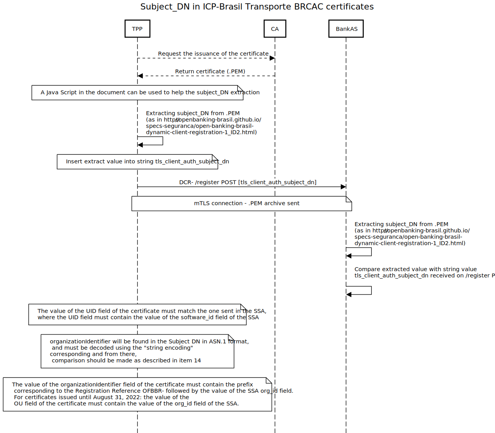

%%%

    #
    # Open Finance Brasil Financial-grade API Dynamic Client Registration Profile 1.0 Implementers Draft 2
    # (open-banking-brasil-dynamic-client-registration-1_ID2)
    #
    #

    Title = "Open Finance Brasil Financial-grade API Dynamic Client Registration 1.0 Implementers Draft 2"
    abbrev = "OFB-FAPI-1-DCR-ID2"
    ipr = "none"
    workgroup = "Open Finance Brasil GT Security"
    keyword = ["FAPI", "Open Finance Brasil GT Security"]

    [seriesInfo]
    name = "Internet-Draft"
    status = "standard"
    value = "open-banking-brasil-dynamic-client-registration-1_ID2-ptbr"

    [[author]]
    initials = "GT"
    surname = "Security"
    fullname = "OFBIS GT Security"
    organization = "Open Finance Brasil Initial Structure"
    abbrev = "OFBIS"
      [author.address]
      email = "gt-seguranca@openbankingbr.org"
      uri = "https://openbankingbrasil.org.br/"

%%%

.# Prefácio  {#Foreword}

The normative version in [English](https://openbanking-brasil.github.io/specs-seguranca/open-banking-brasil-dynamic-client-registration-1_ID2.html)

A Estrutura Inicial do Open Finance Brasil (EIOFB) é responsável por criar os padrões e especificações necessários para atender aos requisitos e obrigações da Legislação do Open Finance do Brasil, conforme originalmente delineado pelo [Banco Central do Brasil](https://www.bcb.gov.br/content/config/Documents/BCB_Open_Banking_Communique-April-2019.pdf). É possível que alguns dos elementos deste documento estejam sujeitos a direitos de patente. O EIOFB não se responsabiliza pela identificação de qualquer ou todos os direitos de patente.

O Perfil de Segurança Financial-grade API 1.0 do Open Finance Brasil consiste nas seguintes partes:

* [Open Finance Brasil Financial-grade API Security Profile 1.0][OFB-FAPI]
* Open Finance Brasil Dynamic Client Registration Profile 1.0

Essas partes devem ser usadas com [RFC6749], [RFC6750], [RFC7636], [OIDC], [OIDR], [RFC7591], [RFC7592], [FAPI-1-Baseline] e [FAPI-1-Advanced]

.# Introdução  {#Introduction}

O Perfil de Registro de Cliente Dinâmico (DCR - *Dynamic Client Registration*) do Financal-grade API (FAPI) do Open Finance Brasil é um perfil de [RFC7591], [RFC7592] e [OIDR] que visa fornecer diretrizes de implementação específicas para segurança e interoperabilidade que podem ser aplicadas à identificação, registro e gerenciamento de *Clients OAuth* operando no ecossistema Open Finance Brasil.

Embora seja possível codificar um *OpenID Provider* e *Relying Party* desde o princípio usando esta especificação, o principal público para esta especificação são as partes que já possuem uma implementação certificada do [OpenID Connect] [OIDC] e desejam obter a certificação para o Open Finance Brasil.

.# Convenções Notacionais  {#Conventions}

As palavras-chave "*deve*" (shall), "*não deve*" (shall not), "*deveria*" (should), "*não deveria*" (should not) e "*pode*" (may) presentes nesse documento devem ser interpretadas conforme as diretrizes descritas em [ISO Directive Part 2][ISODIR2] observando  seguinte equivalência:

* "deve" => equivalente ao termo "shall" e expressa um requerimento definido no documento (nas traduções é similar ao termo "must", que pode denotar um requerimento externo ao documento);
* "não deve" => equivalente ao termo "shall not" e também expressa um requerimento definido no documento;
* "deveria" e "não deveria"=> equivalente ao termo "should" e "should not" e expressa uma recomendação
* "pode" => equivalente ao termo "may" indica uma permissão

Estas palavras-chave não são usadas como termos de dicionário, de modo que qualquer ocorrência deles deve ser interpretada como palavras-chave e não devem ser interpretados com seus significados de linguagem natural.

{mainmatter}

# Escopo  {#Scope}

Este documento especifica o método de

* aplicativos cadastrados no [Diretorio de Participantes do Open Finance](https://web.directory.openbankingbrasil.org.br) para descobrir OpenID Providers que oferecem serviços no ecossistema Open Finance Brasil;
* aplicativos para usar o [OpenID Connect Registration][OIDR] para integrar seus aplicativos com OpenID Providers dos bancos; e
* aplicativos para usar [OAuth 2.0 Dynamic Client Registration Management Protocol][RFC7592] para gerenciar seus aplicativos com OpenID Providers;

Este documento é aplicável a todos os participantes do Open Finance no Brasil.

# Referências normativas  {#Normative}

Os seguintes documentos referenciados são indispensáveis para a aplicação deste documento. Para referências datadas, apenas a edição citada se aplica. Para referências não datadas, a última edição do documento referenciado (incluindo quaisquer emendas) se aplica.

[ISODIR2] - ISO/IEC Directives Part 2
[ISODIR2]: <https://www.iso.org/sites/directives/current/part2/index.xhtml

[RFC6749] - The OAuth 2.0 Authorization Framework
[RFC6749]: <https://tools.ietf.org/html/rfc6749

[RFC6750] - The OAuth 2.0 Authorization Framework: Bearer Token Usage
[RFC6750]: <https://tools.ietf.org/html/rfc6750

[RFC7636] - Proof Key for Code Exchange by OAuth Public Clients
[RFC7636]: <https://tools.ietf.org/html/rfc7636

[RFC6819] - OAuth 2.0 Threat Model and Security Considerations
[RFC6819]: <https://tools.ietf.org/html/rfc6819

[RFC7519] - JSON Web Token (JWT)
[RFC7519]: <https://tools.ietf.org/html/rfc7519

[RFC7591] - OAuth 2.0 Dynamic Client Registration Protocol
[RFC7591]: <https://tools.ietf.org/html/rfc7591

[RFC7592] - OAuth 2.0 Dynamic Client Registration Management Protocol
[RFC7592]: <https://tools.ietf.org/html/rfc7592

[BCP195] - Recommendations for Secure Use of Transport Layer Security (TLS) and Datagram Transport Layer Security (DTLS)
[BCP195]: <https://tools.ietf.org/html/bcp195

[OIDC] - OpenID Connect Core 1.0 incorporating errata set 1
[OIDC]: <https://openid.net/specs/openid-connect-core-1_0.html

[FAPI-CIBA] - Financial-grade API: Client Initiated Backchannel Authentication Profile
[FAPI-CIBA]: <https://bitbucket.org/openid/fapi/src/master/Financial_API_WD_CIBA.md

[RFC4514] - Lightweight Directory Access Protocol (LDAP): String Representation of Distinguished Names
[RFC4514]: <https://www.rfc-editor.org/rfc/rfc4514

[RFC4517] - Lightweight Directory Access Protocol (LDAP): Syntaxes and Matching Rules
[RFC4517]: <https://www.rfc-editor.org/rfc/rfc4517

[OIDD] -  OpenID Connect Discovery 1.0 incorporating errata set 1
[OIDD]: <https://openid.net/specs/openid-connect-discovery-1_0.html

[OIDR] -  OpenID Connect Registration 1.0 incorporating errata set 1
[OIDR]: <https://openid.net/specs/openid-connect-registration-1_0.html

[RFC8705] - OAuth 2.0 Mutual TLS Client Authentication and Certificate Bound Access Tokens
[RFC8705]: <https://tools.ietf.org/html/rfc8705

[JARM] - Financial-grade API: JWT Secured Authorization Response Mode for OAuth 2.0 (JARM)
[JARM]: <https://bitbucket.org/openid/fapi/src/master/Financial_API_JWT_Secured_Authorization_Response_Mode.md

[PAR] - OAuth 2.0 Pushed Authorization Requests
[PAR]: <https://tools.ietf.org/html/draft-ietf-oauth-par

[JAR] - OAuth 2.0 JWT Secured Authorization Request
[JAR]: <https://tools.ietf.org/html/draft-ietf-oauth-jwsreq

[FAPI-1-Baseline] - Financial-grade API Security Profile 1.0 - Part 1: Baseline
[FAPI-1-Baseline]: <https://openid.net/specs/openid-financial-api-part-1-1_0.html

[FAPI-1-Advanced] - Financial-grade API Security Profile 1.0 - Part 2: Advanced
[FAPI-1-Advanced]: <https://openid.net/specs/openid-financial-api-part-2-1_0.html

[OFB-FAPI] - Open Finance Brasil Financial-grade API Security Profile 1.0
[OFB-FAPI]: <https://openbanking-brasil.github.io/specs-seguranca/open-banking-brasil-financial-api-1_ID3.html

[OFB-Cert-Standards] - Open Finance Brasil x.509 Certificate Standards
[OFB-Cert-Standards]: <https://openbanking-brasil.github.io/specs-seguranca/open-banking-brasil-certificate-standards-1_ID1.html

[OFB-DCR/DCM-Swagger] - DCR & DCM Swagger 
[OFB-DCR/DCM-Swagger]: <https://raw.githubusercontent.com/OpenBanking-Brasil/specs-seguranca/main/dcr_review/dcr-dcm-swagger.yaml

# Termos e definições  {#Definitions}

Para efeitos deste documento, aplicam-se os termos definidos em [RFC6749], [RFC6750], [RFC7636], [OpenID Connect Core][OIDC] e ISO29100.

# Símbolos e Termos abreviados  {#Abreviations}

* **API** – Application Programming Interface (Interface de Programação da Aplicação)
* **DCR** – Dynamic Client Registration (Registro de Cliente Dinâmico)
* **FAPI** - Financial-grade API
* **HTTP** – Hyper Text Transfer Protocol
* **OIDF** - OpenID Foundation
* **REST** – Representational State Transfer
* **SS** – Software Statement (Declaração de Software)
* **SSA** – Software Statement Assertion (Afirmação de Declaração de Software)
* **TLS** – Transport Layer Security

# Introdução  {#Intro}

O ecossistema Open Finance Brasil apoia-se em um provedor de confiança ou _diretório de participantes_ como a fonte mais valiosa de informações sobre participantes credenciados e softwares que estão autorizados a participar do ecossistema Open Finance Brasil.

Os serviços do Diretório incluem:

* Registro e gerenciamento de software
* Registro e gerenciamento de credenciais de software usando certificados ICP
* Geração de Software Statement Assertion (SSA)

Os participantes do ecossistema devem aproveitar esses serviços para facilitar o registro de cliente OAuth orientado por API usando o processo descrito na cláusula 3.1.1 do [RFC7591] com metadados adicionais necessários para oferecer suporte ao OpenID Connect definido em [OpenID Connect Registration][OIDR]. 

É importante reforçar que o payload de registro de clientes possui a maior parte de seus atributos não obrigatórios, e que os atributos cujos valores  conflitem com os presentes no software statement assertion *serão sobrepostos pelos valores do próprio software statement assertion emitido pelo diretório central*. Nem todos os metadados que um cliente deseja fornecer podem estar contidos em um *software statement*, por exemplo, alternativa [Metadata Languages and Script values](https://openid.net/specs/openid-connect-registration-1_0.html#LanguagesAndScripts). Há casos ainda de metadados de cliente que são um subconjunto dos valores existentes no SSA, como por exemplo os redirect_URIs.

# Provisionamentos do OpenID Connect Discovery do Open Finance Brasil  {#Provisions}

## Servidor de Autorização  {#AuthServers}

O servidor de autorização deve suportar [OpenID Connect Discovery][OIDD] conforme exigido pelo [Financial-grade API Security Profile 1.0 - Part 1: Baseline][FAPI-1-Baseline]. Este suporte deve estar explicito tanto na forma como o Servidor de Autorização está registrado no Diretório de Participantes quanto na declaração dos seus atributos no arquivo de Discovery (well-known), respeitando os mecanismos de autenticação certificados pela institição através dos testes de conformidade do Open Finance Brasil. 

Adicionalmente, o Servidor de Autorização:

1. deve anunciar sua presença no ecossistema Open Finance Brasil, sendo listada no Diretório de Participantes;
2. deve anunciar todos os recursos API REST do Open Finance Brasil protegidos pelo Provedor OpenID no Diretório de Participantes;
3. deve anunciar suporte para todos os mecanismos de assinatura, criptografia, autenticação e padrões necessários para suportar o [Open Finance Brasil Financial API][OFB-FAPI];
4. deve anunciar suporte para [OpenID Dynamic Client Registration][OIDR];
5. deve anunciar `mtls_endpoint_aliases` de acordo com a cláusula 5 [RFC 8705 OAuth 2.0 Mutual-TLS Client Authentication e Certificate-Bound Access Tokens][RFC8705] o `token_endpoint`, `registration_endpoint` e `userinfo_endpoint`;
6. se suportar [OAuth 2.0 Pushed Authorisation Requests][PAR], deve anunciar por meio de [OIDD] `mtls_endpoint_aliases` o `push_authorization_request_endpoint`;
7. se suportar [Financial API - Client Initiated Back Channel Authentication][FAPI-CIBA], deve anunciar através de [OIDD] `mtls_endpoint_aliases` o `backchannel_authentication_endpoint`;

## Cliente  {#Client}

O cliente deve suportar [OpenID Connect Discovery][OIDD] conforme exigido pelo [Financial-grade API Security Profile 1.0 - Part 1: Baseline][FAPI-1-Baseline].

Além disso, o Cliente

1. deve contar com serviços de descoberta do ecossistemas fornecidos apenas pelo Diretório de Participantes;
2. deve derivar os metadados necessários do Authorization Server somente por meio do serviço OpenID Connect Discovery dos Authorization Servers;
3. quando presente, deve usar endpoints anunciados em `mtls_endpoint_aliases` conforme a cláusula 5 [RFC 8705 OAuth 2.0 Mutual-TLS Client Authentication e Certificate-Bound Access Tokens][RFC8705];

# Provisionamento de registro OpenID Connect do Open Finance Brasil  {#Registration}

## Servidor de Autorização  {#RegAuth}

O servidor de autorização deve suportar as RFCs de Dynamic Client Registration (DCR) [RFC7591], Dynamic Client Management (DCM) [RFC7592] e [OpenID Registration][OIDR]

Além disso, o servidor de autorização

1. deve rejeitar as solicitações de registro de cliente dinâmico não realizadas em uma conexão protegida com mTLS usando certificados emitidos pelo Brasil ICP (produção) ou o Diretório de Participantes (sandbox);
2. deve validar que a solicitação contém _software\_statement_ JWT assinado usando o algoritmo `PS256` emitido pelo Diretório de Participantes do Open Finance Brasil;
3. deve validar que o _software\_statement_ foi emitido (iat  - *issued at*) não mais de 5 minutos antes do pedido ser recebido;
4. deve validar que um atributo `jwks` (definida por valor) **não** foi incluído, e sim declarado como referência no atributo `jwks_uri`;
5. deve, quando informado, validar que o `jwks_uri` corresponda ao `software_jwks_uri` fornecido na declaração do software;
6. deve exigir e validar que o `redirect_uris` corresponda ou contenha um subconjunto dos valores de `software_redirect_uris` fornecidos no _software\_statement_;
7. deve exigir e validar que todos os mecanismos de autenticação de cliente cumpram os requisitos definidos nas [RFC7591] e [RFC7592], através da validação do `registration_access_token` e, como conexão segura, da cadeia de certificados confiáveis ICP-Brasil.
8. _removido_;
9. deve validar se os escopos solicitados são adequados para as permissões regulatórias autorizadas da instituição e contidas no _software\_statement\. A relação de permissões regulatórias e os escopos correspondentes está descrita nas seções a seguir.
10. deve, sempre que possível, validar os metadados declarados pelo cliente em relação aos metadados fornecidos no _software\_statement_, adotando os valores presentes no SSA com precedência.
11. deve aceitar todos os nomes x.500 AttributeType definidas no _Distinguished Name_ dos Perfis de Certificado x.509 definidos em [Open Finance Brasil x.509 Certificate Standards][OFB-Cert-Standards];
12. se for compatível com o mecanismo de autenticação do cliente `tls_client_auth`, conforme definido em [RFC8705], somente deve aceitar `tls_client_auth_subject_dn` como uma indicação do valor do atributo _subject_ do certificado, conforme definido na cláusula 2.1.2 [RFC8705];
13. O valor do campo *UID* do certificado deve coincidir com o enviado no SSA, onde o campo *UID* deve conter o valor do campo *software_id* do SSA.
14. O campo *organizationIdentifier* será encontrado no subject_DN em formato ASN.1 e deverá ser decodificado respeitando o string enconding correspondente. O valor do campo *organizationIdentifier* do certificado que deve conter o prefixo correspondente ao Registration Reference *OFBBR-* seguido do valor do campo *org_id* do SSA. Deve-se converter os valores do campo OID 2.5.4.97 do formato ASN.1 para texto legível para humanos. 
Para certificados emitidos até 31 de Agosto de 2022: o valor do campo *OU* do certificado deve conter o valor do campo *org_id* do SSA.
15. deve, durante o processo de handshake TLS, usar a regra `distinguishedNameMatch` para comparar os valores DN conforme definido na [RFC4517].
16. deve ser garantido a todos, após os mesmos atos de consentimentos permanentes, para que também sejam alterados para instituições receptoras de dados transparentes (TPP).
17. deve realizar recertificação FAPI e DCR OIDF após eventuais alterações sistêmicas.

Estas disposições aplicam-se igualmente ao processamento de pedidos [RFC7591], [RFC7592] e [OpenID Registration][OIDR]

### Aplicando Server Defaults  {#Server}

Quando as propriedades de uma solicitação DCR não estão incluídas e não são obrigatórias na especificação, o Authorization Server deve aplicar os padrões do cliente da seguinte maneira:

1. deve selecionar e aplicar o algoritmo de criptografia e a escolha da cifra a partir dos conjuntos mais recomendados de cifra da IANA que são suportados pelo Servidor de Autorização;
2. deve preencher *defaults* a partir de valores da afirmação de _software\_statement_, sempre que possível;
3. deve conceder ao cliente permissão para o conjunto completo de escopos potenciais com base nas permissões regulatórias de softwares incluídas no _software\_statement_;

### Análise do Distinguished Name do Certificado  {#Certificate}

A cláusula 3 do [Lightweight Directory Access Protocol (LDAP): String Representation of Distinguished Names][RFC4514] define os OIDs obrigatórios cujas as _strings_ do AttributeType (descritores) devem ser reconhecidos pelos implementadores. Esta lista obrigatória não inclui vários dos OIDs definidos em [Open Finance Brasil x.509 Certificate Standards][OFB-Cert-Standards], nem existe um mecanismo definido para os Servidores de Autorização publicarem informações sobre o formato que eles esperam de uma Solicitação Dinâmica de Registro do Cliente (_Dynamic Client Registrarion_) que inclui um `tls_client_auth_subject_dn`.

Para resolver essa ambiguidade, o Servidor de Autorização deve aceitar exclusivamente os AttributeType (descritores) definidas no último parágrafo da cláusula 3 [RFC4514] em formato string,  também deve aceitar em formato OID, com seus valores em ASN.1, todos os AttributeTypes definidos no Distinguished Name [Open Finance Brasil x.509 Certificate Standards][OFB-Cert-Standards] ou adicionados pela Autoridade Certificadora.

Em caso de não atendimento destes requisitos o Servidor de Autorização deverá rejeitar o registro.

Segue na tabela abaixo como deve ser feita a decodificação:

- Obtenha na ordem reversa os atributos do certificado
- Concatene cada RDN (RelativeDistinguishedName) com uma virgula (',')
- Use as strings da RFC (CN, L, ST, O, OU, C, Street, DC, UID) com o valor dos seus atributos legível para humanos
- Use os OIDs dos atributos definidos nesta especificação para uso no OFB (businessCategory = OID 2.5.4.15, jurisdictionCountryName = OID 1.3.6.1.4.1.311.60.2.1.3, serialNumber = OID 2.5.4.5, organizationIdentifier = OID 2.5.4.97) com o valor dos seus atributos em formato ASN.1 seguindo a RFC4514, sendo que:
    - Os nomes dos atributos devem ser definidos seguindo a notação ponto-decimal, sem adição de prefixo “OID”, ex. “2.5.4.15”, seguido dos sinais de (‘=#’) mais o      valor hexadecimal do atributo, exemplo final: 2.5.4.15=#0C1450726976617465204F7267616E697A6174696F6E
    - Não há qualquer restrição para as codificações/formatações utilizadas nos valores dos atributos. Deve ser respeitado o uso em hexadecimal apresentado na          codificação utilizada no atributo do certificado (PrintableString, UTF8String, etc). Este item atende à opcionalidade do formato já estabelecido pela AC frente        aos normativos ICP e ao itens 2.3, 2.4 e 5.2 da RFC4514.
-Para atender ao padrão DCR, converta os valores ASN.1 do OID 2.5.4.97 organizationIdentifier para texto legível para humanos, utilize recursos do seu API gateway ou uma biblioteca padrão do tipo ASN.1 ou se necessário ainda desenvolva manualmente. Para isso recupere o valor completo do OID 2.5.4.97 contido no subject_DN. Remova a notação ponto-decimal (2.5.4.97). Remova os sinais de (‘=#’). Converta o valor de hexadecimal para texto. Aplique um filtro usando expressão regular para recuperar o org_id após (‘OFBBR-’), por exemplo: 2.5.4.97=#132A4F464242522D36376335373838322D303433622D313165632D396130332D303234326163313330303033. Remova a notação ponto-decimal e sinais (‘=#’): 2.5.4.97=#. Converta o valor hexadecimal 132A4F464242522D36376335373838322D303433622D313165632D396130332D303234326163313330303033 para texto: **OFBBR-67c57882-043b-11ec-9a03-0242ac130003. Aplique a expressão regular e recupere o org_id que está contido após ‘OFBBR-’:67c57882-043b-11ec-9a03-0242ac130003.           

Seguem abaixo exemplos para os atributos obrigatórios das ACs ativas até 31 de Agosto de 2022:

| subject_dn                                                                                                                                                                                                                                                                                | Issuer                                                                                                                 |
|-------------------------------------------------------------------------------------------------------------------------------------------------------------------------------------------------------------------------------------------------------------------------------------------|------------------------------------------------------------------------------------------------------------------------|
| UID=67c57882-043b-11ec-9a03-0242ac130003,1.3.6.1.4.1.311.60.2.1.3=#13024252,2.5.4.15=#131450726976617465204f7267616e697a6174696f6e,2.5.4.5=#130e3133333533323336303030313839,CN= mycn.bank.gov.br,OU=497e1ffe-b2a2-4a4e-8ef0-70633fd11b59,O=My Public Bank,L=BRASILIA,ST=DF,C=BR   | issuer=CN=Open Banking SANDBOX Issuing CA   - G1,OU=Open Banking,O=Open   Banking Brasil,C=BR                          |
| UID=67c57882-043b-11ec-9a03-0242ac130003,1.3.6.1.4.1.311.60.2.1.3=#13024252,2.5.4.15=#0C0F427573696E65737320456E74697479,CN=mycn.bank.gov.br,2.5.4.5=#130e3133333533323336303030313839,OU=497e1ffe-b2a2-4a4e-8ef0-70633fd11b59,O=My Public Bank,L=BRASILIA,ST=DF,C=BR    | issuer=CN=Autoridade Certificadora do SERPRO SSLv1,OU=Autoridade   Certificadora Raiz Brasileira v10,O=ICP-Brasil,C=BR |
| 1.3.6.1.4.1.311.60.2.1.3=#13024252,2.5.4.15=#131450726976617465204f7267616e697a6174696f6e,UID=67c57882-043b-11ec-9a03-0242ac130003,CN=openbanking.mybank.com.br,2.5.4.5=#130e3133333533323336303030313839,OU=497e1ffe-b2a2-4a4e-8ef0-70633fd11b59,L=Goiania,ST=GO,O=MyBank SA,C=BR | issuer=CN=AC SOLUTI SSL EV,OU=Autoridade   Certificadora Raiz Brasileira v10,O=ICP-Brasil,C=BR                         |
| CN=mycn.bank.com.br,UID=67c57882-043b-11ec-9a03-0242ac130003,OU=497e1ffe-b2a2-4a4e-8ef0-70633fd11b59,L=Sao Paulo,ST=SP,O=MyBank SA,C=BR,2.5.4.5=#130e3133333533323336303030313839,1.3.6.1.4.1.311.60.2.1.3=#13024252,2.5.4.15=#0C0F427573696E65737320456E74697479         | issuer=CN=AC SERASA SSL EV,OU=Autoridade   Certificadora Raiz Brasileira v10,O=ICP-Brasil,C=BR                         |

Seguem abaixo exemplos para os atributos obrigatórios das ACs ativas após 31 de Agosto de 2022:

| subject_dn                                                                                                                                                                                                                                                                                | Issuer                                                                                                                 |
|-------------------------------------------------------------------------------------------------------------------------------------------------------------------------------------------------------------------------------------------------------------------------------------------|------------------------------------------------------------------------------------------------------------------------|
| UID=67c57882-043b-11ec-9a03-0242ac130003,2.5.4.97=#0C2A4F464242522D36376335373838322D303433622D313165632D396130332D303234326163313330303033,1.3.6.1.4.1.311.60.2.1.3=#13024252,2.5.4.15=#131450726976617465204f7267616e697a6174696f6e,2.5.4.5=#130e3133333533323336303030313839,CN= mycn.bank.gov.br,OU=497e1ffe-b2a2-4a4e-8ef0-70633fd11b59,O=My Public Bank,L= BRASILIA,ST=DF,C=BR         | issuer=CN=AC SERASA SSL EV,OU=Autoridade   Certificadora Raiz Brasileira v10,O=ICP-Brasil,C=BR                         |
| UID=67c57882-043b-11ec-9a03-0242ac130003,1.3.6.1.4.1.311.60.2.1.3=#13024252,2.5.4.15=#131450726976617465204f7267616e697a6174696f6e,CN=mycn.bank.gov.br,2.5.4.5=#130e3133333533323336303030313839,2.5.4.97=#132A4F464242522D36376335373838322D303433622D313165632D396130332D303234326163313330303033,O=My Public Bank,L=BRASILIA,ST=DF,C=BR         | issuer=CN=AC SERASA SSL EV,OU=Autoridade   Certificadora Raiz Brasileira v10,O=ICP-Brasil,C=BR                         |

## Funções regulatórias para mapeamentos OpenID e OAuth 2.0  {#Regs}

Para participar do ecossistema do Open Finance, as instituições credenciadas devem se cadastrar no Diretório de Participantes de acordo com seus papéis regulatórios. Essas funções refletem a autorização do Banco Central para as instituições e, consequentemente, as APIs que podem utilizar.

A tabela a seguir descreve as funções regulatórias do Open Finance e o mapeamento de escopos do OAuth 2.0 relacionado. Se os escopos forem omitidos durante o processo de DCR, o Servidor de Autorização deve conceder o conjunto completo de escopos potenciais com base nas funções regulatórias registradas para o banco, conforme descrito na seção Server Defaults.

| Papel Regulador | Descrição                                                           | Escopos Permitidos                                                                                                                   | Fase-alvo |
|-----------------|---------------------------------------------------------------------|--------------------------------------------------------------------------------------------------------------------------------------|-----------|
| DADOS           | Instituição transmissora / receptora de dados (AISP)                | openid accounts credit-cards-accounts consents customers invoice-financings financings loans unarranged-accounts-overdraft resources | Phase 2   |
| PAGTO           | Instituição prestadora de serviço de iniciação de pagamentos (PISP) | openid payments                                                                                                                      | Phase 3   |
| CONTA           | Instituição detentora de conta (ASPSP)                              | openid                                                                                                                               | Phase 3   |
| CCORR           | Correspondente de crédito                                           | openid                                                                                                                               | Phase 3*  |

É necessário validar as roles ativas no _software\_statement_ da aplicação. Na validação dessa informação deve ser utilizado o campo _software\_statement\_roles, e deve ser verificado se as roles listadas estão ativas.

## Registro do Cliente {#registro_tls_client_auth}

Deve-se ser respeitada a seção 4.2.11 da RFC 4517 (caseIgnoreMatch).
No processo de registro do cliente, utilizando-se o método de autenticação _tls\_client\_auth_, o cliente deve encaminhar o campo _tls\_client\_auth\_subject\_dn_ com os AttibuteTypes(Descritores) em formato definido no item 7.1.2. Em caso de não aderencia a este padrão o registro será rejeitado.

# Declaração de Software  {#SSA}

Uma declaração de software (_software\_statement_) é um JSON Web Token (JWT) [RFC7519] que afirma valores de metadados sobre o software cliente como um todo. Na estrutura do Open Finance Brasil, esse _software\_statement_ é assinado pelo Diretório de Participantes, e sua assinatura DEVE ser validada pelos Servidores de Autorizacao usando as chaves públicas disponíveis na seção a seguir.


## Atributos da Declaração de Software (Claims)  {#Claims}

O exemplo a seguir contém todos os atributos atualmente incluídos em um _software\_statement_:

```
{
  "software_mode": "Live",
  "software_redirect_uris": [
    "https://www.raidiam.com/accounting/cb"
  ],
  "software_statement_roles": [
    {
      "role": "DADOS",
      "authorisation_domain": "Open Banking",
      "status": "Active"
    },
    {
      "role": "PAGTO",
      "authorisation_domain": "Open Banking",
      "status": "Active"
    }
  ],
  "software_client_name": "Raidiam Accounting",
  "org_status": "Active",
  "software_client_id": "Cki1EbvjwyhPB12NGLlz2",
  "iss": "Open Banking Open Banking Brasil prod SSA issuer",
  "software_tos_uri": "https://www.raidiam.com/accounting/tos.html",
  "software_client_description": "Raidiam Accounting leverage cutting edge open banking access to bring you real time up to date views of your finances",
  "software_jwks_uri": "https://keystore.directory.openbankingbrasil.org.br/b961c4eb-509d-4edf-afeb-35642b38185d/25556d5a-b9dd-4e27-aa1a-cce732fe74de/application.jwks",
  "software_policy_uri": "https://www.raidiam.com/accounting/policy.html",
  "software_id": "25556d5a-b9dd-4e27-aa1a-cce732fe74de",
  "software_client_uri": "https://www.raidiam.com/accounting.html",
  "software_jwks_inactive_uri": "https://keystore.directory.openbankingbrasil.org.br/b961c4eb-509d-4edf-afeb-35642b38185d/25556d5a-b9dd-4e27-aa1a-cce732fe74de/inactive/application.jwks",
  "software_jwks_transport_inactive_uri": "https://keystore.directory.openbankingbrasil.org.br/b961c4eb-509d-4edf-afeb-35642b38185d/25556d5a-b9dd-4e27-aa1a-cce732fe74de/inactive/transport.jwks",
  "software_jwks_transport_uri": "https://keystore.directory.openbankingbrasil.org.br/b961c4eb-509d-4edf-afeb-35642b38185d/25556d5a-b9dd-4e27-aa1a-cce732fe74de/transport.jwks",
  "software_logo_uri": "https://www.raidiam.com/accounting/logo.png",
  "org_id": "b961c4eb-509d-4edf-afeb-35642b38185d",
  "org_number": "112233445566",
  "software_environment": "production",
  "software_version": "1.1",
  "software_roles": [
    "DADOS",
    "PAGTO"
  ],
  "org_name": "Open Banking Brasil",
  "iat": 1620060821,
  "organisation_competent_authority_claims": [
    {
      "authorisation_domain": "Open Banking",
      "authorisations": [],
      "registration_id": "13353236-OBB-CONTA",
      "authority_id": "687a1c94-b360-4e04-9589-0fa5cb16451b",
      "authority_name": "Banco Central",
      "authorisation_role": "CONTA",
      "authority_code": "BCB",
      "status": "Active"
    },
    {
      "authorisation_domain": "Open Banking",
      "authorisations": [],
      "registration_id": "13353236-OBB-DADOS",
      "authority_id": "687a1c94-b360-4e04-9589-0fa5cb16451b",
      "authority_name": "Banco Central",
      "authorisation_role": "DADOS",
      "authority_code": "BCB",
      "status": "Active"
    },
    {
      "authorisation_domain": "Open Banking",
      "authorisations": [],
      "registration_id": "13353236-OBB-PAGTO",
      "authority_id": "687a1c94-b360-4e04-9589-0fa5cb16451b",
      "authority_name": "Banco Central",
      "authorisation_role": "PAGTO",
      "authority_code": "BCB",
      "status": "Active"
    }
  ]
}
```

# Processamento de solicitação de registro de cliente dinâmico  {#dcr}

!---

!---

Os passos do processo de extração do subject_DN estão descritos na seção 7.1.2

!---

!---

## Enviar uma solicitação com uma declaração de software  {#exampleDcr}

Este exemplo inclui vários campos opcionais, alguns dos quais podem não ser aplicáveis a algumas implantações. Para um guia completo dos atributos e sua obrigatoriedade, consultar o Swagger DCR [OFB-DCR/DCM-Swagger].
A quebra de linha dentro dos valores são apenas para fins de exibição.

```
POST /reg HTTP/1.1
Host: auth.raidiam.com
Content-Type: application/json
{
"application_type": "web",
"grant_types": [
    "client_credentials",
    "authorization_code",
    "refresh_token",
    "implicit"
],
"id_token_signed_response_alg": "PS256",
"require_auth_time": false,
"response_types": [
    "code id_token",
    "id_token"
],
"software_statement": "eyJraWQiOiJzaWduZXIiLCJ0eXAiOiJKV1QiLCJhbGciOiJQUzI1NiJ9.eyJzb2Z0d2FyZV9tb2RlIjoiTGl2ZSIsInNvZnR3YXJlX3JlZGlyZWN0X3VyaXMiOlsiaHR0cHM6XC9cL3d3dy5yYWlkaWFtLmNvbVwvYWNjb3VudGluZ1wvY2IiXSwic29mdHdhcmVfc3RhdGVtZW50X3JvbGVzIjpbeyJyb2xlIjoiREFET1MiLCJhdXRob3Jpc2F0aW9uX2RvbWFpbiI6Ik9wZW4gQmFua2luZyIsInN0YXR1cyI6IkFjdGl2ZSJ9LHsicm9sZSI6IlBBR1RPIiwiYXV0aG9yaXNhdGlvbl9kb21haW4iOiJPcGVuIEJhbmtpbmciLCJzdGF0dXMiOiJBY3RpdmUifV0sInNvZnR3YXJlX2NsaWVudF9uYW1lIjoiUmFpZGlhbSBBY2NvdW50aW5nIiwib3JnX3N0YXR1cyI6IkFjdGl2ZSIsInNvZnR3YXJlX2NsaWVudF9pZCI6IkNraTFFYnZqd3loUEIxMk5HTGx6MiIsImlzcyI6Ik9wZW4gQmFua2luZyBPcGVuIEJhbmtpbmcgQnJhc2lsIHByb2QgU1NBIGlzc3VlciIsInNvZnR3YXJlX3Rvc191cmkiOiJodHRwczpcL1wvd3d3LnJhaWRpYW0uY29tXC9hY2NvdW50aW5nXC90b3MuaHRtbCIsInNvZnR3YXJlX2NsaWVudF9kZXNjcmlwdGlvbiI6IlJhaWRpYW0gQWNjb3VudGluZyBsZXZlcmFnZSBjdXR0aW5nIGVkZ2Ugb3BlbiBiYW5raW5nIGFjY2VzcyB0byBicmluZyB5b3UgcmVhbCB0aW1lIHVwIHRvIGRhdGUgdmlld3Mgb2YgeW91ciBmaW5hbmNlcyIsInNvZnR3YXJlX2p3a3NfZW5kcG9pbnQiOiJodHRwczpcL1wva2V5c3RvcmUuZGlyZWN0b3J5Lm9wZW5iYW5raW5nYnJhc2lsLm9yZy5iclwvYjk2MWM0ZWItNTA5ZC00ZWRmLWFmZWItMzU2NDJiMzgxODVkXC8yNTU1NmQ1YS1iOWRkLTRlMjctYWExYS1jY2U3MzJmZTc0ZGVcL2FwcGxpY2F0aW9uLmp3a3MiLCJzb2Z0d2FyZV9wb2xpY3lfdXJpIjoiaHR0cHM6XC9cL3d3dy5yYWlkaWFtLmNvbVwvYWNjb3VudGluZ1wvcG9saWN5Lmh0bWwiLCJzb2Z0d2FyZV9pZCI6IjI1NTU2ZDVhLWI5ZGQtNGUyNy1hYTFhLWNjZTczMmZlNzRkZSIsInNvZnR3YXJlX2NsaWVudF91cmkiOiJodHRwczpcL1wvd3d3LnJhaWRpYW0uY29tXC9hY2NvdW50aW5nLmh0bWwiLCJzb2Z0d2FyZV9qd2tzX2luYWN0aXZlX2VuZHBvaW50IjoiaHR0cHM6XC9cL2tleXN0b3JlLmRpcmVjdG9yeS5vcGVuYmFua2luZ2JyYXNpbC5vcmcuYnJcL2I5NjFjNGViLTUwOWQtNGVkZi1hZmViLTM1NjQyYjM4MTg1ZFwvMjU1NTZkNWEtYjlkZC00ZTI3LWFhMWEtY2NlNzMyZmU3NGRlXC9pbmFjdGl2ZVwvYXBwbGljYXRpb24uandrcyIsInNvZnR3YXJlX2p3a3NfdHJhbnNwb3J0X2luYWN0aXZlX2VuZHBvaW50IjoiaHR0cHM6XC9cL2tleXN0b3JlLmRpcmVjdG9yeS5vcGVuYmFua2luZ2JyYXNpbC5vcmcuYnJcL2I5NjFjNGViLTUwOWQtNGVkZi1hZmViLTM1NjQyYjM4MTg1ZFwvMjU1NTZkNWEtYjlkZC00ZTI3LWFhMWEtY2NlNzMyZmU3NGRlXC9pbmFjdGl2ZVwvdHJhbnNwb3J0Lmp3a3MiLCJzb2Z0d2FyZV9qd2tzX3RyYW5zcG9ydF9lbmRwb2ludCI6Imh0dHBzOlwvXC9rZXlzdG9yZS5kaXJlY3Rvcnkub3BlbmJhbmtpbmdicmFzaWwub3JnLmJyXC9iOTYxYzRlYi01MDlkLTRlZGYtYWZlYi0zNTY0MmIzODE4NWRcLzI1NTU2ZDVhLWI5ZGQtNGUyNy1hYTFhLWNjZTczMmZlNzRkZVwvdHJhbnNwb3J0Lmp3a3MiLCJzb2Z0d2FyZV9sb2dvX3VyaSI6Imh0dHBzOlwvXC93d3cucmFpZGlhbS5jb21cL2FjY291bnRpbmdcL2xvZ28ucG5nIiwib3JnX2lkIjoiYjk2MWM0ZWItNTA5ZC00ZWRmLWFmZWItMzU2NDJiMzgxODVkIiwic29mdHdhcmVfZW52aXJvbm1lbnQiOiJwcm9kdWN0aW9uIiwic29mdHdhcmVfdmVyc2lvbiI6MS4xMCwic29mdHdhcmVfcm9sZXMiOlsiREFET1MiLCJQQUdUTyJdLCJvcmdfbmFtZSI6Ik9wZW4gQmFua2luZyBCcmFzaWwiLCJpYXQiOjE2MTgzMzYyNjIsIm9yZ2FuaXNhdGlvbl9jb21wZXRlbnRfYXV0aG9yaXR5X2NsYWltcyI6W3siYXV0aG9yaXNhdGlvbl9kb21haW4iOiJPcGVuIEJhbmtpbmciLCJhdXRob3Jpc2F0aW9ucyI6W10sInJlZ2lzdHJhdGlvbl9pZCI6IjEzMzUzMjM2LU9CQi1DT05UQSIsImF1dGhvcml0eV9pZCI6IjY4N2ExYzk0LWIzNjAtNGUwNC05NTg5LTBmYTVjYjE2NDUxYiIsImF1dGhvcmlzYXRpb25fcm9sZSI6IkNPTlRBIiwiYXV0aG9yaXR5X2NvZGUiOiJCQ0IiLCJzdGF0dXMiOiJBY3RpdmUifSx7ImF1dGhvcmlzYXRpb25fZG9tYWluIjoiT3BlbiBCYW5raW5nIiwiYXV0aG9yaXNhdGlvbnMiOltdLCJyZWdpc3RyYXRpb25faWQiOiIxMzM1MzIzNi1PQkItREFET1MiLCJhdXRob3JpdHlfaWQiOiI2ODdhMWM5NC1iMzYwLTRlMDQtOTU4OS0wZmE1Y2IxNjQ1MWIiLCJhdXRob3Jpc2F0aW9uX3JvbGUiOiJEQURPUyIsImF1dGhvcml0eV9jb2RlIjoiQkNCIiwic3RhdHVzIjoiQWN0aXZlIn0seyJhdXRob3Jpc2F0aW9uX2RvbWFpbiI6Ik9wZW4gQmFua2luZyIsImF1dGhvcmlzYXRpb25zIjpbXSwicmVnaXN0cmF0aW9uX2lkIjoiMTMzNTMyMzYtT0JCLVBBR1RPIiwiYXV0aG9yaXR5X2lkIjoiNjg3YTFjOTQtYjM2MC00ZTA0LTk1ODktMGZhNWNiMTY0NTFiIiwiYXV0aG9yaXNhdGlvbl9yb2xlIjoiUEFHVE8iLCJhdXRob3JpdHlfY29kZSI6IkJDQiIsInN0YXR1cyI6IkFjdGl2ZSJ9XX0.W6hUAYhjT6I61rxEIVMKYKre93LTbRdzKnk9dJvUdzVgAz5B9KxZNutf27oO3k0hrjYVWBdWq23o_e4Y_AaKdpS9-rtU84JiHtmqV0wcFYIM8nqcUVWqQ-Ux6Nq9L2G-s2YNd3PcJ1e3yGg9h8553Gr7iJusKEgApzXUpkM2rBELQuumktUE_JBiuIkXmWxoRnO1cW-Osbk3MT3bxG43SPcxii07Q5S8qXI6PjCPA3fYlnaUAygwZM3O0oa7jqmSr7d9UsHuDMJfYhIKdq2wyQQKORCN-D2UopmMX-lHMvAVkkrAO08T0-7odjr4PJk-PrwuoCxeAfa7440ZDOrlmQ",
"subject_type": "public",
"token_endpoint_auth_method": "private_key_jwt",
"request_object_signing_alg": "PS256",
"require_signed_request_object": true,
"require_pushed_authorization_requests": false,
"tls_client_certificate_bound_access_tokens": true,
"client_id": "aCnBHjZBvD6ku3KVBaslL",
"client_name": "Raidiam Accounting",
"client_uri": "https://www.raidiam.com/accounting.html",
"request_object_encryption_alg": "RSA-OAEP",
"request_object_encryption_enc": "A256GCM"
"jwks_uri": "https://keystore.directory.openbankingbrasil.org.br/b961c4eb-509d-4edf-afeb-35642b38185d/25556d5a-b9dd-4e27-aa1a-cce732fe74de/application.jwks",
"redirect_uris": [
    "https://www.raidiam.com/accounting/cb"
]
}
```

## Open Finance Brasil SSA Key Store e detalhes do emissor  {#keystore}

As links a seguir apontam para as chaves públicas do Diretório de Participantes, e devem ser usadas para verificar a validadade da assinatura dos _software\_statements_ apresentados durante o processo de registro de cliente. 

**Producão**

[https://keystore.directory.openbankingbrasil.org.br/openbanking.jwks](https://keystore.directory.openbankingbrasil.org.br/openbanking.jwks)

Emissor do Open Finance Open Finance Brasil SSA de produção

**Sandbox**

[https://keystore.sandbox.directory.openbankingbrasil.org.br/openbanking.jwks](https://keystore.sandbox.directory.openbankingbrasil.org.br/openbanking.jwks)

Emissor do Open Finance Open Finance Brasil SSA de sandbox

## Sobre os mecanismos de autenticação e autorização dos serviços de DCR e DCM {#dcr-dcm}

Por serem serviços auxiliares ao fluxo principal do Open Finance Brasil, os serviços de registro e manutenção dinâmica de clientes não utilizam os mesmos mecanismos de controle de acesso. Por exemplo: não é possível exigir um _access\_token_ OAuth 2.0 de uma aplicação cliente que ainda não está registrada na instituição transmissora. 
Para estender as [RFC7591] e [RFC7592], que recomendam mecanismos mínimos para autenticação dos seus serviços, as instituições que suportam os fluxos de registro e manutenção dinâmica de clientes devem implementar em seus Servidores de Autorização os controles a seguir:

### Registro de cliente - POST /register {#post-register}

1. validar que o certificado apresentado pela aplicação cliente é subordinado às cadeias do ICP-Brasil definidas no Padrão de Certificados do Open Finance Brasil;
2. enquanto houver a necessidade do período de convivência (mencionado no tópico 7.1) deve ser implementado a validação para ambos os casos: certificados que possuem o valor *org_id* no campo *organizationUnitName* (*OU*) e certificados que possuem o valor *org_id* no campo *organizationIdentifier*.
3. assegurar que a assinatura do _software\_statement_ apresentado pela aplicação cliente durante o registro tenha sido feita pelo Diretório de Participantes através das chaves públicas descritas na seção anterior;
4. assegurar que o _software\_statement_ apresentado pela aplicação cliente durante o registro corresponda à mesma instituição do certificado de cliente apresentado, validando-o através dos atributos que trazem `organization_id` no certificado X.509.
5. não devem ser permitidos múltiplos cadastros DCR para o mesmo Software Statement , de forma que em caso de tentativa de novo registro para um Software Statement já cadastrado, deve se utilizar o procedimento de Error Response definido no item 3.2.2 da RFC7591.
6. emitir, na resposta do registro, um `registration_access_token` para ser usado como token de autenticação nas operações de manutenção da aplicação cliente registrada, seguindo as especificações descritas na [RFC7592].

### Manutenção de cliente - GET /register - PUT /register - DELETE /register {#get-put-delete}
1. validar que o certificado apresentado pela aplicação cliente é subordinado às cadeias do ICP-Brasil definidas no Padrão de Certificados do Open Finance Brasil;
2. validar a presença e a correspondência do header Bearer `Authorization` contendo o valor do atributo `registration_access_token` retornado durante o registro do cliente correspondente.

*Observação:* A [RFC7592] prevê a possibilidade de rotação do `registration_access_token` emitido pelo Servidor de Autorização a cada uso, tornando-o um token de uso único. As instituições devem considerar esse aspecto no registro de suas aplicações cliente para receber e atualizar o `registration_access_token` pelo novo valor recebido nas chamadas de manutenção de cliente.

# Reconhecimento  {#acknowledgements}

Agradecemos a todos que estabeleceram as bases para o compartilhamento seguro de dados por meio da formação do Grupo de Trabalho OpenID Foundation FAPI, o GT de Segurança do Open Finance Brasil e aos pioneiros que ficarão em seus ombros.

As seguintes pessoas contribuíram para este documento:

* Alexandre Daniel Dalabrida (Cooperativa Central Ailos)
* Alexandre Siqueira (Mercado Pago)
* André Borges (Banco Fibra)
* Bernardo Vale (Banco Inter)
* Danilo Sasaki (Banco Itaú)
* João Rodolfo Vieira da Silva (Banco Itaú)
* Michelle Bandarra (Chicago)
* Nic Marcondes (Quanto)
* Rafael Gonzalez Hashimoto (Banco C6)
* Ralph Bragg (Raidiam)

{backmatter}

# Avisos  {#Notice}

Copyright (c) 2022 Estrutura Inicial do Open Finance Brasil

A Estrutura Inicial do Open Finance Brasil (EIOFB) concede a qualquer Colaborador, desenvolvedor, implementador ou outra parte interessada uma licença de direitos autorais mundial não exclusiva, livre de royalties para reproduzir, preparar trabalhos derivados, distribuir, executar e exibir, estes Implementadores Rascunho ou Especificação Final exclusivamente para fins de (i) desenvolver especificações e (ii) implementar Rascunhos de Implementadores e Especificações Finais com base em tais documentos, desde que a atribuição seja feita ao EIOFB como a fonte do material, mas que tal atribuição o faça não indica endosso do EIOFB.

A tecnologia descrita nesta especificação foi disponibilizada a partir de contribuições de várias fontes, incluindo membros da OpenID Foundation, do Grupo de Trabalho de Segurança do Open Finance Brasil e outros. Embora a Estrutura Inicial do Open Finance Brasil tenha tomado medidas para ajudar a garantir que a tecnologia esteja disponível para distribuição, ela não toma posição quanto à validade ou escopo de qualquer propriedade intelectual ou outros direitos que possam ser reivindicados como pertencentes à implementação ou uso do tecnologia descrita nesta especificação ou até que ponto qualquer licença sob tais direitos pode ou não estar disponível; nem representa que fez qualquer esforço independente para identificar tais direitos. A Estrutura Inicial do Open Finance Brasil e os contribuidores desta especificação não oferecem (e por meio deste expressamente se isentam de quaisquer) garantias (expressas, implícitas ou de outra forma), incluindo garantias implícitas de comercialização, não violação, adequação a uma finalidade específica ou título, relacionados a esta especificação, e todo o risco quanto à implementação desta especificação é assumido pelo implementador. A política de Direitos de Propriedade Intelectual do Open Finance Brasil exige que os contribuidores ofereçam uma promessa de patente de não fazer valer certas reivindicações de patentes contra outros contribuidores e implementadores. A Estrutura Inicial do Open Finance Brasil convida qualquer parte interessada a trazer à sua atenção quaisquer direitos autorais, patentes, pedidos de patentes ou outros direitos de propriedade que possam abranger a tecnologia que possa ser necessária para praticar esta especificação.

## Apêndice A. Exemplo de afirmação de declaração de software  {#ExampleA}

```
eyJraWQiOiJzaWduZXIiLCJ0eXAiOiJKV1QiLCJhbGciOiJQUzI1NiJ9.eyJzb2Z0d2FyZV9tb2RlIjoiTGl2ZSIsInNvZnR3YXJlX3JlZGlyZWN0X3VyaXMiOlsiaHR0cHM6XC9cL3d3dy5yYWlkaWFtLmNvbVwvYWNjb3VudGluZ1wvY2IiXSwic29mdHdhcmVfc3RhdGVtZW50X3JvbGVzIjpbeyJyb2xlIjoiREFET1MiLCJhdXRob3Jpc2F0aW9uX2RvbWFpbiI6Ik9wZW4gQmFua2luZyIsInN0YXR1cyI6IkFjdGl2ZSJ9LHsicm9sZSI6IlBBR1RPIiwiYXV0aG9yaXNhdGlvbl9kb21haW4iOiJPcGVuIEJhbmtpbmciLCJzdGF0dXMiOiJBY3RpdmUifV0sInNvZnR3YXJlX2NsaWVudF9uYW1lIjoiUmFpZGlhbSBBY2NvdW50aW5nIiwib3JnX3N0YXR1cyI6IkFjdGl2ZSIsInNvZnR3YXJlX2NsaWVudF9pZCI6IkNraTFFYnZqd3loUEIxMk5HTGx6MiIsImlzcyI6Ik9wZW4gQmFua2luZyBPcGVuIEJhbmtpbmcgQnJhc2lsIHByb2QgU1NBIGlzc3VlciIsInNvZnR3YXJlX3Rvc191cmkiOiJodHRwczpcL1wvd3d3LnJhaWRpYW0uY29tXC9hY2NvdW50aW5nXC90b3MuaHRtbCIsInNvZnR3YXJlX2NsaWVudF9kZXNjcmlwdGlvbiI6IlJhaWRpYW0gQWNjb3VudGluZyBsZXZlcmFnZSBjdXR0aW5nIGVkZ2Ugb3BlbiBiYW5raW5nIGFjY2VzcyB0byBicmluZyB5b3UgcmVhbCB0aW1lIHVwIHRvIGRhdGUgdmlld3Mgb2YgeW91ciBmaW5hbmNlcyIsInNvZnR3YXJlX2p3a3NfZW5kcG9pbnQiOiJodHRwczpcL1wva2V5c3RvcmUuZGlyZWN0b3J5Lm9wZW5iYW5raW5nYnJhc2lsLm9yZy5iclwvYjk2MWM0ZWItNTA5ZC00ZWRmLWFmZWItMzU2NDJiMzgxODVkXC8yNTU1NmQ1YS1iOWRkLTRlMjctYWExYS1jY2U3MzJmZTc0ZGVcL2FwcGxpY2F0aW9uLmp3a3MiLCJzb2Z0d2FyZV9wb2xpY3lfdXJpIjoiaHR0cHM6XC9cL3d3dy5yYWlkaWFtLmNvbVwvYWNjb3VudGluZ1wvcG9saWN5Lmh0bWwiLCJzb2Z0d2FyZV9pZCI6IjI1NTU2ZDVhLWI5ZGQtNGUyNy1hYTFhLWNjZTczMmZlNzRkZSIsInNvZnR3YXJlX2NsaWVudF91cmkiOiJodHRwczpcL1wvd3d3LnJhaWRpYW0uY29tXC9hY2NvdW50aW5nLmh0bWwiLCJzb2Z0d2FyZV9qd2tzX2luYWN0aXZlX2VuZHBvaW50IjoiaHR0cHM6XC9cL2tleXN0b3JlLmRpcmVjdG9yeS5vcGVuYmFua2luZ2JyYXNpbC5vcmcuYnJcL2I5NjFjNGViLTUwOWQtNGVkZi1hZmViLTM1NjQyYjM4MTg1ZFwvMjU1NTZkNWEtYjlkZC00ZTI3LWFhMWEtY2NlNzMyZmU3NGRlXC9pbmFjdGl2ZVwvYXBwbGljYXRpb24uandrcyIsInNvZnR3YXJlX2p3a3NfdHJhbnNwb3J0X2luYWN0aXZlX2VuZHBvaW50IjoiaHR0cHM6XC9cL2tleXN0b3JlLmRpcmVjdG9yeS5vcGVuYmFua2luZ2JyYXNpbC5vcmcuYnJcL2I5NjFjNGViLTUwOWQtNGVkZi1hZmViLTM1NjQyYjM4MTg1ZFwvMjU1NTZkNWEtYjlkZC00ZTI3LWFhMWEtY2NlNzMyZmU3NGRlXC9pbmFjdGl2ZVwvdHJhbnNwb3J0Lmp3a3MiLCJzb2Z0d2FyZV9qd2tzX3RyYW5zcG9ydF9lbmRwb2ludCI6Imh0dHBzOlwvXC9rZXlzdG9yZS5kaXJlY3Rvcnkub3BlbmJhbmtpbmdicmFzaWwub3JnLmJyXC9iOTYxYzRlYi01MDlkLTRlZGYtYWZlYi0zNTY0MmIzODE4NWRcLzI1NTU2ZDVhLWI5ZGQtNGUyNy1hYTFhLWNjZTczMmZlNzRkZVwvdHJhbnNwb3J0Lmp3a3MiLCJzb2Z0d2FyZV9sb2dvX3VyaSI6Imh0dHBzOlwvXC93d3cucmFpZGlhbS5jb21cL2FjY291bnRpbmdcL2xvZ28ucG5nIiwib3JnX2lkIjoiYjk2MWM0ZWItNTA5ZC00ZWRmLWFmZWItMzU2NDJiMzgxODVkIiwic29mdHdhcmVfZW52aXJvbm1lbnQiOiJwcm9kdWN0aW9uIiwic29mdHdhcmVfdmVyc2lvbiI6MS4xMCwic29mdHdhcmVfcm9sZXMiOlsiREFET1MiLCJQQUdUTyJdLCJvcmdfbmFtZSI6Ik9wZW4gQmFua2luZyBCcmFzaWwiLCJpYXQiOjE2MTgzMzYyNjIsIm9yZ2FuaXNhdGlvbl9jb21wZXRlbnRfYXV0aG9yaXR5X2NsYWltcyI6W3siYXV0aG9yaXNhdGlvbl9kb21haW4iOiJPcGVuIEJhbmtpbmciLCJhdXRob3Jpc2F0aW9ucyI6W10sInJlZ2lzdHJhdGlvbl9pZCI6IjEzMzUzMjM2LU9CQi1DT05UQSIsImF1dGhvcml0eV9pZCI6IjY4N2ExYzk0LWIzNjAtNGUwNC05NTg5LTBmYTVjYjE2NDUxYiIsImF1dGhvcmlzYXRpb25fcm9sZSI6IkNPTlRBIiwiYXV0aG9yaXR5X2NvZGUiOiJCQ0IiLCJzdGF0dXMiOiJBY3RpdmUifSx7ImF1dGhvcmlzYXRpb25fZG9tYWluIjoiT3BlbiBCYW5raW5nIiwiYXV0aG9yaXNhdGlvbnMiOltdLCJyZWdpc3RyYXRpb25faWQiOiIxMzM1MzIzNi1PQkItREFET1MiLCJhdXRob3JpdHlfaWQiOiI2ODdhMWM5NC1iMzYwLTRlMDQtOTU4OS0wZmE1Y2IxNjQ1MWIiLCJhdXRob3Jpc2F0aW9uX3JvbGUiOiJEQURPUyIsImF1dGhvcml0eV9jb2RlIjoiQkNCIiwic3RhdHVzIjoiQWN0aXZlIn0seyJhdXRob3Jpc2F0aW9uX2RvbWFpbiI6Ik9wZW4gQmFua2luZyIsImF1dGhvcmlzYXRpb25zIjpbXSwicmVnaXN0cmF0aW9uX2lkIjoiMTMzNTMyMzYtT0JCLVBBR1RPIiwiYXV0aG9yaXR5X2lkIjoiNjg3YTFjOTQtYjM2MC00ZTA0LTk1ODktMGZhNWNiMTY0NTFiIiwiYXV0aG9yaXNhdGlvbl9yb2xlIjoiUEFHVE8iLCJhdXRob3JpdHlfY29kZSI6IkJDQiIsInN0YXR1cyI6IkFjdGl2ZSJ9XX0.W6hUAYhjT6I61rxEIVMKYKre93LTbRdzKnk9dJvUdzVgAz5B9KxZNutf27oO3k0hrjYVWBdWq23o_e4Y_AaKdpS9-rtU84JiHtmqV0wcFYIM8nqcUVWqQ-Ux6Nq9L2G-s2YNd3PcJ1e3yGg9h8553Gr7iJusKEgApzXUpkM2rBELQuumktUE_JBiuIkXmWxoRnO1cW-Osbk3MT3bxG43SPcxii07Q5S8qXI6PjCPA3fYlnaUAygwZM3O0oa7jqmSr7d9UsHuDMJfYhIKdq2wyQQKORCN-D2UopmMX-lHMvAVkkrAO08T0-7odjr4PJk-PrwuoCxeAfa7440ZDOrlmQ
```
